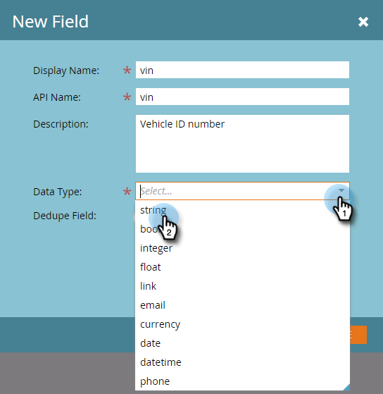

# Marketo 사용자 지정 개체 필드 추가 {#add-marketo-custom-object-fields}

사용자 지정 개체를 만든 후에는 비즈니스 요구 사항에 맞게 사용자 지정 개체에 필드를 추가해야 합니다.

필드는 사용자 지정 개체에서 사용하는 특정 정보를 정의합니다. 링크 필드에는 사용자 지정 개체를 연결하는 특수 작업이 있으며 [개별 문서](/help/marketo/product-docs/administration/marketo-custom-objects/add-marketo-custom-object-link-fields.md)에서 다룹니다.

1. **[!UICONTROL 관리자]** 영역으로 이동합니다.

   

1. **[!UICONTROL Marketo 사용자 지정 개체]**&#x200B;를 클릭합니다.

   

1. 오른쪽의 필드를 추가할 개체를 선택합니다.

   

1. **[!UICONTROL 필드]** 탭을 클릭한 다음 **[!UICONTROL 새 필드]**&#x200B;을 클릭합니다.

   

   >[!NOTE]
   >
   >위에 표시된 세 필드는 사용자 지정 개체를 만들 때 Marketo에 의해 자동으로 만들어집니다. Marketo에서 이러한 필드를 자동으로 관리하므로 편집하거나 삭제할 수 없습니다.

1. [!UICONTROL 표시 이름] 및 (선택 사항) [!UICONTROL 설명]을(를) 입력하십시오.

   

   >[!NOTE]
   >
   >API 이름은 승인될 때까지만 편집할 수 있습니다.

1. 이제 목록에서 적절한 [!UICONTROL 데이터 형식]을(를) 선택하십시오.

   

1. 새 필드를 고유 식별자로 사용하려면 [!UICONTROL 중복 제거] 슬라이더를 가져옵니다. **[!UICONTROL 저장]**&#x200B;을 클릭하여 완료합니다.

   

   >[!TIP]
   >
   >데이터 중복 제거 필드를 사용하여 사용자 정의 객체를 검색, 업데이트 또는 삭제할 수 있습니다. 모든 사용자 정의 객체 정의에는 최소 1개(및 최대 3개)의 중복 제거 필드가 포함되어야 합니다.

1. 필요한 다른 필드를 추가합니다.

   >[!NOTE]
   >
   >일대다 구조를 작성하는 경우 사용자 지정 개체에 링크 필드를 추가해야 합니다. 다대다 구조의 경우 사용자 지정 개체에는 링크 필드가 필요하지 않지만 중간 개체에 두 개의 링크 필드를 추가해야 합니다. 링크 필드를 만들려면 [Marketo 사용자 지정 개체 링크 필드 추가](/help/marketo/product-docs/administration/marketo-custom-objects/add-marketo-custom-object-fields.md)를, 사용자 지정 개체 유형에 대한 자세한 내용은 [Marketo 사용자 지정 개체 이해](/help/marketo/product-docs/administration/marketo-custom-objects/understanding-marketo-custom-objects.md)를 참조하십시오.

>[!MORELIKETHIS]
>
>* [Marketo 사용자 지정 개체 링크 필드 추가](/help/marketo/product-docs/administration/marketo-custom-objects/add-marketo-custom-object-link-fields.md)
>* [Marketo 사용자 지정 개체 편집 및 삭제](/help/marketo/product-docs/administration/marketo-custom-objects/edit-and-delete-a-marketo-custom-object.md)
>* [Marketo 사용자 지정 개체 필드 편집 및 삭제](/help/marketo/product-docs/administration/marketo-custom-objects/edit-and-delete-marketo-custom-object-fields.md)
>* [Marketo 사용자 지정 개체 이해](/help/marketo/product-docs/administration/marketo-custom-objects/understanding-marketo-custom-objects.md)
