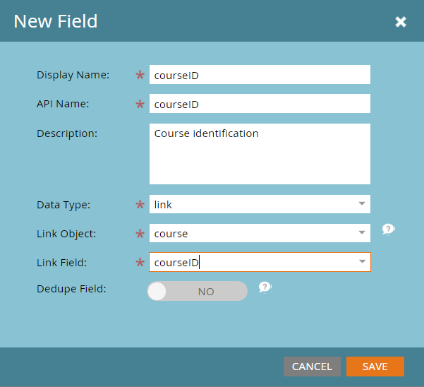

# Marketo 사용자 지정 개체 링크 필드 추가 {#add-marketo-custom-object-link-fields}

사용자 지정 개체를 만들 때 사용자 지정 개체 레코드를 올바른 부모 레코드에 연결하기 위한 링크 필드를 제공해야 합니다.

* 일대다 사용자 지정 구조의 경우 사용자 지정 개체의 링크 필드를 사용하여 개인 또는 회사에 연결합니다.
* 다대다 구조의 경우 별도로 만든 중간 개체(사용자 지정 개체의 유형이기도 함)에서 연결된 두 개의 링크 필드를 사용합니다. 한 링크는 데이터베이스의 사람 또는 회사에 연결되고 다른 링크는 사용자 지정 개체에 연결됩니다. 이 경우 링크 필드는 사용자 지정 개체 자체에 있지 않습니다.

>[!IMPORTANT]
>
>Marketo Engage은 다대다 관계의 각 브리지 객체에 대해 단일 에지 객체만 지원합니다. 아래 샘플에서 각 등록은 단일 과정에만 연결할 수 있습니다. 그러나 각 과정에 많은 학생이 등록(다대일 관계)한 것처럼 Edge 객체마다 Bridge 객체가 많을 수 있습니다. 각 Edge 개체 레코드(일대다 또는 다대다)에 대해 두 개 이상의 Bridge 개체 레코드가 존재하도록 사용자 지정 개체 데이터를 구조화한 경우, 각 레코드가 단일 Edge 개체 레코드를 참조하는 여러 Bridge 개체 레코드를 만들어 Marketo의 해당 데이터를 나타낼 수 있습니다.

## 일대다 구조에 대한 링크 필드 만들기 {#create-a-link-field-for-a-one-to-many-structure}

일대다 구조에 대한 사용자 지정 개체에 링크 필드를 만드는 방법은 다음과 같습니다.

1. **[!UICONTROL 관리자]** 영역으로 이동합니다.

   

1. **[!UICONTROL Marketo 사용자 지정 개체]**&#x200B;를 클릭합니다.

   

1. 목록에서 사용자 지정 개체를 선택합니다.

   

1. **[!UICONTROL 필드]** 탭에서 **[!UICONTROL 새 필드]**&#x200B;을(를) 클릭합니다.

   

1. 링크 필드 이름을 지정하고 선택적 [!UICONTROL 설명]을(를) 추가합니다. [!UICONTROL 링크] 데이터 형식을 선택하십시오.

   

   >[!CAUTION]
   >
   >사용자 지정 개체가 승인되면 돌아가서 [!UICONTROL 링크] 또는 [!UICONTROL 중복 제거 필드]를 만들거나 편집하거나 삭제할 수 없습니다.

1. [!UICONTROL 링크 개체]가 [!UICONTROL 리드] (개인)에 대한 것인지 [!UICONTROL 회사]에 대한 것인지 선택하십시오.

   

   >[!NOTE]
   >
   >[!UICONTROL 리드]를 선택하면 목록에 ID, 이메일 주소 및 사용자 지정 필드가 표시됩니다.
   >
   >[!UICONTROL 회사]를 선택하면 목록에 ID와 사용자 지정 필드가 표시됩니다.

1. 연결할 [!UICONTROL 링크 필드]를 새 필드의 상위로 선택합니다.

   

   >[!NOTE]
   >
   >링크 필드에서는 문자열 필드 유형만 지원됩니다.

1. **[!UICONTROL 저장]**&#x200B;을 클릭합니다.

   

## 다대다 구조에 대한 링크 필드 만들기 {#create-a-link-field-for-a-many-to-many-structure}

다대다 구조에서 사용할 중간 개체에 링크 필드를 만드는 방법은 다음과 같습니다.

>[!PREREQUISITES]
>
>중간 개체 및 연결하려는 사용자 지정 개체를 이미 만들었어야 합니다.

1. **[!UICONTROL 관리자]** 영역으로 이동합니다.

   

1. **[!UICONTROL Marketo 사용자 지정 개체]**&#x200B;를 클릭합니다.

   

1. 필드를 추가할 중간 개체를 선택합니다.

   

1. **[!UICONTROL 필드]** 탭에서 **[!UICONTROL 새 필드]**&#x200B;을(를) 클릭합니다.

   

1. 두 개의 링크 필드를 만들어야 합니다. 한 번에 하나씩 만듭니다. 먼저 데이터베이스 목록의 멤버에 대한 필드 이름을 지정합니다(예: leadID). 선택적 [!UICONTROL 설명]을(를) 추가합니다. [!UICONTROL 링크] [!UICONTROL 데이터 형식]을(를) 선택하십시오.

   

   >[!CAUTION]
   >
   >사용자 지정 개체가 승인되면 돌아가서 [!UICONTROL 링크] 또는 [!UICONTROL 중복 제거 필드]를 만들거나 편집하거나 삭제할 수 없습니다.

1. 데이터베이스에서 [!UICONTROL 링크 개체]를 선택하십시오. 이 경우 [!UICONTROL 잠재 고객]입니다.

   

1. 연결할 [!UICONTROL 링크 필드]를 선택합니다. 이 경우 [!UICONTROL Id]입니다.

   

   >[!NOTE]
   >
   >[!UICONTROL 링크 필드]에서는 문자열 필드 형식만 지원됩니다.

1. **[!UICONTROL 저장]**&#x200B;을 클릭합니다.

   

1. 사용자 지정 개체에 대한 두 번째 링크(이 예에서는 courseID)에 대해 이 프로세스를 반복합니다. [!UICONTROL 링크 개체] 이름은 과정이고 [!UICONTROL 링크 필드]은(는) 과정 ID입니다. 이미 강의 사용자 지정 객체를 생성 및 승인했으므로 이러한 선택 사항은 드롭다운 메뉴에서 사용할 수 있습니다.

   

1. enrollmentID 또는 등급과 같이 중간 개체에서 사용할 다른 필드를 만듭니다.

## 사용자 지정 개체 사용 {#using-custom-objects}

다음 단계는 스마트 캠페인의 필터에서 이러한 사용자 지정 개체를 사용하는 것입니다. 다대다 관계를 사용하면 여러 사람/회사와 여러 사용자 지정 개체를 선택할 수 있습니다. 아래 예제에는 이러한 기준과 일치하는 데이터베이스의 모든 사용자가 나열됩니다. 과정 이름 필드는 과정 사용자 지정 개체에서 가져오고 등록 등급은 중간 개체에서 가져옵니다.

>[!MORELIKETHIS]
>
>* [Marketo 사용자 지정 개체 필드 추가](/help/marketo/product-docs/administration/marketo-custom-objects/add-marketo-custom-object-fields.md)
>* [Marketo 사용자 지정 개체 편집 및 삭제](/help/marketo/product-docs/administration/marketo-custom-objects/edit-and-delete-a-marketo-custom-object.md)
>* [Marketo 사용자 지정 개체 이해](/help/marketo/product-docs/administration/marketo-custom-objects/understanding-marketo-custom-objects.md)
>* [Marketo 사용자 지정 개체 필드 편집 및 삭제](/help/marketo/product-docs/administration/marketo-custom-objects/edit-and-delete-marketo-custom-object-fields.md)
