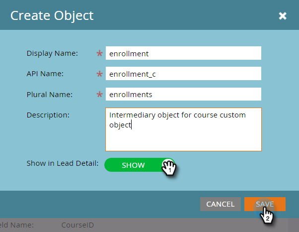

# Marketo 사용자 지정 개체 만들기 {#create-marketo-custom-objects}

Marketo의 사용자 지정 개체를 사용하여 비즈니스와 관련된 지표를 추적합니다. 이는 자동차, 교육 과정 등 캠페인을 실행하기 위해 Marketo에서 모델링하려는 모든 것이 될 수 있습니다.

>[!NOTE]
>
>사용자 지정 개체가 일대다 또는 다대다 기준으로 작동하도록 설정할 수 있습니다. 초기 개체는 같은 방법으로 만들지만, 개체에 필드를 추가하기 시작할 때 단계가 달라집니다. 자세한 내용은 [Marketo 사용자 지정 개체 이해](/help/marketo/product-docs/administration/marketo-custom-objects/understanding-marketo-custom-objects.md)를 참조하십시오.

>[!NOTE]
>
>사용자 지정 개체가 승인된 후에는 링크 또는 중복 제거 필드를 생성, 편집 또는 삭제할 수 없습니다.

## 일대다 구조에 대한 사용자 지정 개체 만들기 {#create-a-custom-object-for-a-one-to-many-structure}

이 예에서는 일대다 구조에서 사용할 Car 사용자 지정 개체를 보여 줍니다. 나중에 다대다 구조에서 사용할 코스 사용자 지정 개체와 중간 개체를 만듭니다.

1. **[!UICONTROL Admin]** 영역으로 이동합니다.

   

1. **[!UICONTROL Marketo Custom Objects]**&#x200B;을(를) 클릭합니다.

   

1. **[!UICONTROL New Custom Object]**&#x200B;을(를) 클릭합니다.

   

   >[!NOTE]
   >
   >[!UICONTROL Marketo Custom Objects] 탭에는 오른쪽에 모든 사용자 지정 개체가 표시되며, 가장 최근 업데이트에서 레코드 및 필드 수를 포함하여 승인된 개체의 세부 정보가 표시됩니다.

1. [!UICONTROL Display Name] 입력. [!UICONTROL API Name] 및 [!UICONTROL Plural Name]이(가) 자동으로 채워집니다. [!UICONTROL Description]&#x200B;(선택 사항)을 입력하십시오.

   

   >[!NOTE]
   >
   >이러한 필드를 만들 때는 편집할 수 있지만 저장한 후에는 [!UICONTROL Plural Name] 필드와 **[!UICONTROL Show in Lead Detail]** 슬라이더만 편집할 수 있습니다.

1. 데이터베이스 페이지에서 사용자 지정 개체 데이터를 보려면 **[!UICONTROL Show in Lead Detail]** 슬라이더를 가져와서 **[!UICONTROL Show]**&#x200B;을(를) 표시합니다. **[!UICONTROL Save]**&#x200B;을(를) 클릭합니다.

   

1. 사용자 지정 개체 정보는 입력한 내용을 표시합니다. 상태가 **[!UICONTROL Draft]**&#x200B;입니다.

   

   다음 단계는 [사용자 지정 개체를 빌드](/help/marketo/product-docs/administration/marketo-custom-objects/add-marketo-custom-object-fields.md)하는 데 필드를 추가하는 것입니다.

   >[!NOTE]
   >
   >목록 가져오기 또는 [API](https://experienceleague.adobe.com/ko/docs/marketo-developer/marketo/rest/rest-api)를 통해서만 Marketo 사용자 지정 개체를 채울 수 있습니다.

## 다대다 구조에 대한 사용자 지정 개체 만들기 {#create-a-custom-object-for-a-many-to-many-structure}

이 예제에서는 사용자/회사와 과정 간에 다대다 관계를 만드는 데 사용할 과정 사용자 지정 개체를 보여 줍니다. 작업이 완료되면 중간 개체를 만들어 데이터베이스의 사람 또는 회사에 연결합니다.

>[!NOTE]
>
>다대다 관계의 경우 사용자 지정 개체에 링크를 만들 필요가 없습니다. 대신 중간 개체에 두 개의 링크를 추가합니다(아래 참조).

1. **[!UICONTROL Admin]** 영역으로 이동합니다.

   

1. **[!UICONTROL Marketo Custom Objects]**&#x200B;을(를) 클릭합니다.

   

1. **[!UICONTROL New Custom Object]**&#x200B;을(를) 클릭합니다.

   

1. [!UICONTROL Display Name] 입력. [!UICONTROL API Name] 및 [!UICONTROL Plural Name]이(가) 자동으로 채워집니다. [!UICONTROL Description]&#x200B;(선택 사항)을 입력하십시오.

   

   >[!NOTE]
   >
   >이러한 필드를 만들 때는 편집할 수 있지만 저장한 후에는 [!UICONTROL Plural Name] 필드와 **[!UICONTROL Show in Lead Detail]** 슬라이더만 편집할 수 있습니다.

1. 데이터베이스 페이지에서 사용자 지정 개체 데이터를 보려면 **[!UICONTROL Show in Lead Detail]** 슬라이더를 가져와서 **[!UICONTROL Show]**&#x200B;을(를) 표시합니다. **[!UICONTROL Save]**&#x200B;을(를) 클릭합니다.

   

1. 사용자 지정 개체 정보는 입력한 내용을 표시합니다. 상태가 **[!UICONTROL Draft]**&#x200B;입니다.

   

   >[!NOTE]
   >
   >목록 가져오기 또는 [API](https://experienceleague.adobe.com/ko/docs/marketo-developer/marketo/rest/rest-api)를 통해서만 Marketo 사용자 지정 개체를 채울 수 있습니다.

다음 단계는 중간 개체를 만드는 것입니다(아래 참조). 그러나 그 전에 연결할 필드를 만들어야 합니다.

## 중간 개체 만들기 {#create-an-intermediary-object}

중간 개체를 사용하여 사용자 지정 개체를 사람 또는 회사에 연결합니다. 이 예제에서는 강의 사용자 지정 개체의 강의를 데이터베이스의 사람 또는 회사에 연결하는 데 사용합니다.

>[!NOTE]
>
>일대다 사용자 지정 개체 구조에 대해 중간 개체를 만들 필요가 없습니다.

1. **[!UICONTROL Admin]** 영역으로 이동합니다.

   

1. **[!UICONTROL Marketo Custom Objects]**&#x200B;을(를) 클릭합니다.

   

1. **[!UICONTROL New Custom Object]**&#x200B;을(를) 클릭합니다.

   

1. [!UICONTROL Display Name] 입력. [!UICONTROL API Name] 및 [!UICONTROL Plural Name]이(가) 자동으로 채워집니다. [!UICONTROL Description]&#x200B;(선택 사항)을 입력하십시오.

   

   >[!NOTE]
   >
   >이러한 필드를 만들 때는 편집할 수 있지만 저장한 후에는 [!UICONTROL Plural Name] 필드와 [!UICONTROL Show in Lead Detail] 슬라이더만 편집할 수 있습니다.

1. 데이터베이스 페이지에서 사용자 지정 개체 데이터를 보려면 **[!UICONTROL Show in Lead Detail]** 슬라이더를 가져와서 **표시**&#x200B;를 표시합니다. **저장**&#x200B;을 클릭합니다.

   

1. 사용자 지정 개체 정보는 입력한 내용을 표시합니다. 상태가 **[!UICONTROL Draft]**&#x200B;입니다.

   다음 단계는 중개 개체를 사용자/회사 및 사용자 지정 개체에 연결하기 위해 [링크 필드를 추가](/help/marketo/product-docs/administration/marketo-custom-objects/add-marketo-custom-object-link-fields.md)하는 것입니다.

>[!MORELIKETHIS]
>
>* [Marketo 사용자 지정 개체 필드 추가](/help/marketo/product-docs/administration/marketo-custom-objects/add-marketo-custom-object-fields.md)
>* [Marketo 사용자 지정 개체 링크 필드 추가](/help/marketo/product-docs/administration/marketo-custom-objects/add-marketo-custom-object-link-fields.md)
>* [Marketo 사용자 지정 개체 이해](/help/marketo/product-docs/administration/marketo-custom-objects/understanding-marketo-custom-objects.md)
