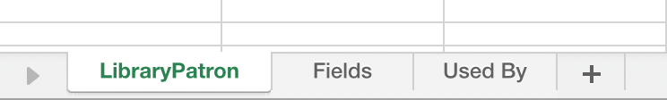

# 사용자 지정 개체 메타데이터 내보내기 {#custom-object-metadata-export}

SOAP API 또는 Munchkin API를 사용하는 경우 사용자 지정 개체 메타데이터 스키마를 내보낼 수 있습니다. 어떻게 구하는지 알려드리겠습니다.

>[!AVAILABILITY]
>
>모든 고객이 이 기능을 구입한 것은 아닙니다. 자세한 내용은 Adobe 계정 팀(계정 관리자)에 문의하십시오.

1. 내 Marketo에서 **관리**.

   

1. 클릭 **Marketo 사용자 지정 개체**.

   

1. 내보낼 Marketo 사용자 지정 개체를 선택합니다.

   

1. 을(를) 클릭합니다. **사용자 지정 개체 작업** 드롭다운 및 선택 **개체 내보내기**.

   

>[!NOTE]
>
>사용자 지정 개체를 내보내려면 승인 상태여야 합니다.

이제 세 탭에 사용자 지정 객체의 스키마가 있는 스프레드시트가 있습니다.

