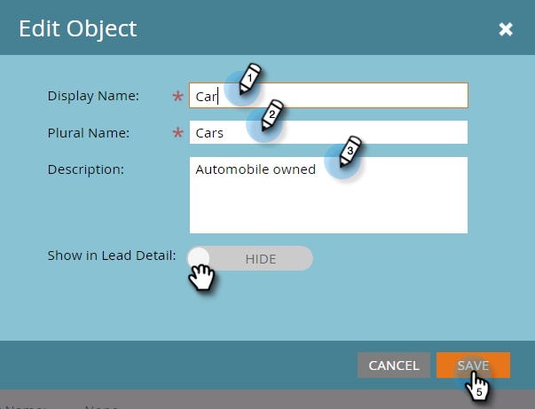

# 마케팅 사용자 지정 개체 편집 및 삭제 {#edit-and-delete-a-marketo-custom-object}

>[!NOTE]
>
>사용자 지정 객체가 승인되면 링크 또는 중복 제거 필드를 생성, 편집 또는 삭제할 수 없습니다.

## 사용자 지정 개체 편집 {#edit-a-custom-object}

사용자 정의 개체를 편집하거나 삭제하려면 [사용자 정의 개체 작업] 메뉴를 사용합니다.

1. **관리**&#x200B;를 클릭하고 **데이터베이스 관리**&#x200B;에서 **마케팅 사용자 지정 개체**&#x200B;를 선택합니다.

   

1. 오른쪽에서 편집할 사용자 정의 개체를 선택합니다.

   

1. **사용자 지정 개체 작업** 탭을 클릭하고 **개체 편집**&#x200B;을 클릭합니다.

   

   >[!NOTE]
   >
   >개체 편집은 편집할 수 없는 API 이름을 제외하고 객체 만들기와 동일한 필드를 표시합니다.

1. 모든 변경 리드 세부 사항 페이지에 개체를 표시하려면 슬라이더를 위로 드래그합니다. **저장**&#x200B;을 클릭합니다.

   

1. [편집된 객체](approve-a-custom-object.md)를 승인해야 합니다.

## 사용자 지정 개체 {#delete-a-custom-object} 삭제

사용자 정의 개체를 손쉽게 삭제할 수 있지만 주의해야 합니다. 사용자 정의 객체는 다른 객체 또는 스마트 목록에 연결될 수 있습니다. 따라서 **삭제**&#x200B;를 클릭하기 전에 Marketing에서 경고를 표시합니다.

>[!CAUTION]
>
>사용자 지정 개체를 삭제한 후에는 복원할 수 없습니다.

1. **관리**&#x200B;를 클릭하고 **데이터베이스 관리**&#x200B;에서 **마케팅 사용자 지정 개체**&#x200B;를 선택합니다.

   

1. 삭제할 객체를 선택합니다.

   

1. **사용자 지정 개체 작업**&#x200B;을 클릭하고 **개체 삭제**&#x200B;를 선택합니다.

   

   >[!TIP]
   >
   >개체를 마우스 오른쪽 단추로 클릭하고 **개체 삭제**&#x200B;를 선택할 수도 있습니다.

1. 사용자 지정 개체가 아직 승인되지 않은 초안 형식의 경우 이 경고가 표시됩니다. 괜찮다면 **삭제**&#x200B;를 클릭합니다.

   

1. 사용자 지정 객체가 이미 승인된 경우 해당 객체를 삭제하면 더 큰 위험이 발생합니다. 그러면, 이 초강력 경고를 받게 될 것입니다. **I understanding**&#x200B;을(를) 입력하고 **실행 취소 불가** 확인란을 선택한 다음 **삭제**&#x200B;를 클릭합니다.

   

   >[!NOTE]
   >
   >사용자 지정 객체가 중간 객체에 연결되어 있는 경우 먼저 중간 객체를 삭제해야 합니다.

>[!MORELIKETHIS]
>
>[사용자 지정 개체 승인](approve-a-custom-object.md)

