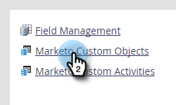

# Marketo 사용자 지정 개체 편집 및 삭제 {#edit-and-delete-a-marketo-custom-object}

>[!NOTE]
>
>사용자 지정 개체가 승인된 후에는 링크 또는 중복 제거 필드를 생성, 편집 또는 삭제할 수 없습니다.

## 사용자 지정 개체 편집 {#edit-a-custom-object}

사용자 지정 객체를 편집하거나 삭제하려면 사용자 지정 객체 작업 메뉴를 사용합니다.

1. **[!UICONTROL 관리자]** 영역으로 이동합니다.

   

1. **[!UICONTROL Marketo 사용자 지정 개체]**&#x200B;를 클릭합니다.

   

1. 오른쪽에서 편집할 사용자 지정 개체를 선택합니다.

   

1. **[!UICONTROL 사용자 지정 개체 작업]** 탭을 클릭하고 **[!UICONTROL 개체 편집]**&#x200B;을 클릭합니다.

   

1. 원하는 대로 변경합니다. 리드 세부 정보 페이지에 객체를 표시하려면 슬라이더를 위로 드래그합니다. **[!UICONTROL 저장]**&#x200B;을 클릭합니다.

   

1. [편집된 개체](/help/marketo/product-docs/administration/marketo-custom-objects/approve-a-custom-object.md)를 승인하십시오.

## 사용자 지정 개체 삭제 {#delete-a-custom-object}

사용자 지정 개체를 삭제하는 것은 쉽지만 주의해야 합니다. 사용자 지정 오브젝트는 다른 오브젝트 또는 스마트 리스트에 연결될 수 있습니다. 따라서 Marketo은 **[!UICONTROL 삭제]**&#x200B;를 클릭하기 전에 경고를 표시합니다.

>[!CAUTION]
>
>사용자 지정 개체를 삭제한 후에는 복원할 수 없습니다.

1. **[!UICONTROL 관리자]** 영역으로 이동합니다.

   

1. **[!UICONTROL Marketo 사용자 지정 개체]**&#x200B;를 클릭합니다.

   

1. 삭제할 객체를 선택합니다.

   

1. **[!UICONTROL 사용자 지정 개체 작업]**&#x200B;을 클릭하고 **[!UICONTROL 개체 삭제]**&#x200B;를 선택합니다.

   

   >[!TIP]
   >
   >개체를 마우스 오른쪽 단추로 클릭하고 **[!UICONTROL 개체 삭제]**&#x200B;를 선택할 수도 있습니다.

1. 사용자 지정 개체가 아직 승인되지 않은 초안 양식인 경우 이 경고가 표시됩니다. 확실하다면 **[!UICONTROL 삭제]**&#x200B;를 클릭하세요.

   

1. 사용자 지정 개체가 이미 승인된 경우에는 삭제하면 더 큰 위험이 있습니다. 그래서, 당신은 이 더 강한 경고를 받게 될 것입니다. **[!UICONTROL 이해할 수 있음]**&#x200B;을 입력하고 **[!UICONTROL 실행 취소할 수 없음]** 확인란을 선택한 다음 **[!UICONTROL 삭제]**&#x200B;를 클릭합니다.

   

   >[!NOTE]
   >
   >사용자 지정 개체가 중간 개체와 연결되어 있으면 먼저 중간 개체를 삭제해야 합니다.

>[!MORELIKETHIS]
>
>[사용자 지정 개체 승인](/help/marketo/product-docs/administration/marketo-custom-objects/approve-a-custom-object.md)
