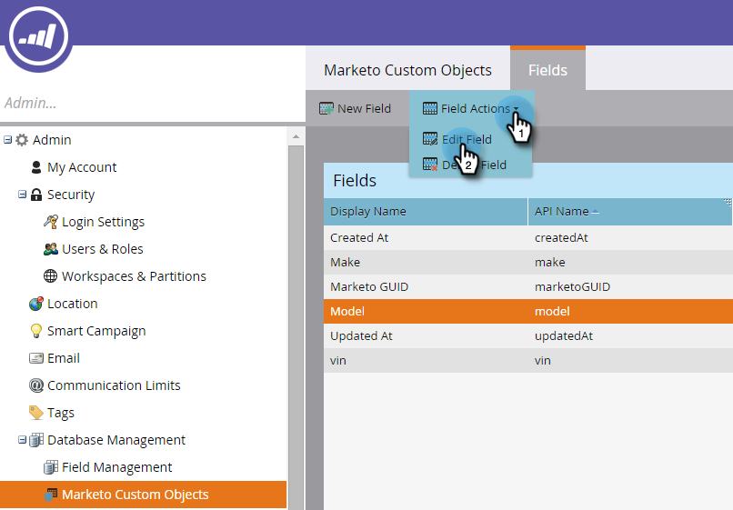

# 마케팅 사용자 지정 개체 필드 편집 및 삭제 {#edit-and-delete-marketo-custom-object-fields}

## 필드 편집 {#edit-a-field}

아직 승인되지 않은 필드를 편집해야 하는 경우가 있습니다.

1. 사용자 지정 개체와 편집할 필드를 클릭합니다.

   

1. 필드 탭에서 **필드 작업** 및 필드 **편집을 클릭합니다**.

   

1. 변경 작업을 수행하고 저장을 **클릭합니다**.

   

   >[!NOTE]
   >
   >API 이름을 편집할 수 없습니다.

1. 변경 사항이 필드 목록에 나타납니다.

   

## 필드 삭제 {#delete-a-field}

사용자 지정 개체에 필드가 더 이상 필요하지 않으면 삭제할 수 있습니다.

1. 필드 탭에서 **필드 작업** 및 필드 **삭제를 클릭합니다**.

   

   트리거를 풀기 전에 필드를 반드시 삭제해야 합니다. 삭제를 **클릭합니다**.

   

1. 사라졌어!

   

   >[!NOTE]
   >
   >**관련 문서**
   >
   >
   >[마케팅 사용자 지정 개체 필드 추가](add-marketo-custom-object-fields.md)

