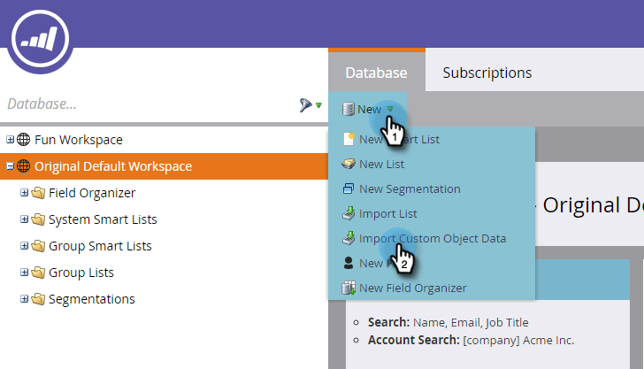
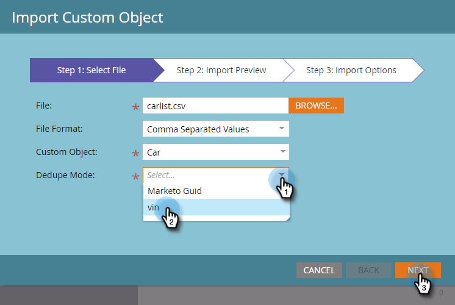
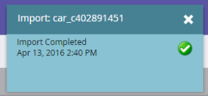

# 사용자 지정 개체 데이터 가져오기 {#import-custom-object-data}

사용자 정의 개체 데이터를 데이터베이스로 쉽게 가져올 수 있습니다. 회사와 함께 사용자 지정 개체를 사용하는 경우 자세한 내용은 [회사와 사용자 지정 개체 사용](http://docs.marketo.com/display/DOCS/Understanding+Marketo+Custom+Objects#UnderstandingMarketoCustomObjects-customcompanyUsingCustomObjectswithCompanies)을 참조하십시오.

1. 내 마켓플레이스에서 **데이터베이스**&#x200B;로 이동합니다.

   

1. **새로 만들기**&#x200B;를 클릭하고 **사용자 지정 개체 데이터 가져오기**&#x200B;를 선택합니다.

   

1. **찾아보기**&#x200B;를 클릭하여 데이터 파일을 찾습니다. 파일 형식(이 예에서는 쉼표로 구분된 값)을 선택합니다.

   

1. 사용자 정의 개체를 선택합니다.

   

1. 드롭다운에서 데이터 중복 제거 모드를 선택합니다. **다음**&#x200B;을 클릭합니다.

   

   >[!NOTE]
   >
   >사용자 지정 개체 레코드를 만들거나 업데이트할 때 데이터 중복 제거 필드를 고유 식별자로 사용합니다. 이 예에서는 **car** 사용자 지정 개체 - vin(차량 ID 번호)의 데이터 중복 제거 필드를 사용합니다. 사용자 지정 개체 레코드만 업데이트하는 경우 Marketing To Guid를 데이터 중복 제거 모드로 선택할 수 있습니다.

1. 드롭다운에서 선택한 각 열을 마케팅 필드에 매핑합니다.

   

   >[!NOTE]
   >
   >파일의 값이 일치시키는 필드 유형과 일치하는지 확인합니다(예: 텍스트, 정수 등). 그렇지 않으면 파일이 거부됩니다.

1. **다음**&#x200B;을 클릭합니다.

   

1. **가져오기**&#x200B;를 클릭합니다.

   

   >[!NOTE]
   >
   >사용자 정의 개체의 크기 제한은 100MB입니다.

   >[!TIP]
   >
   >가져오기가 완료되면 **경고 보내기:** 필드에 이메일 주소를 입력합니다.

1. 화면의 오른쪽 상단에는 가져오기가 실행되는 동안 알림이 표시되고, 가져오기가 완료되면 최종 결과가 표시됩니다.

   

   야호!

>[!MORELIKETHIS]
>
>* [마케팅 사용자 지정 개체 이해](understanding-marketo-custom-objects.md)

>

