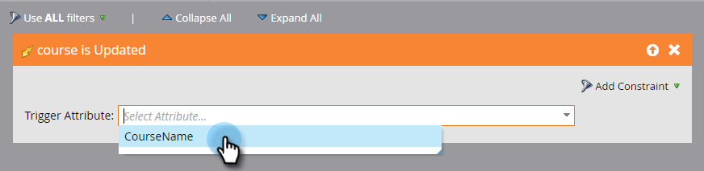

# 사용자 지정 개체 변경 트리거 {#trigger-off-custom-object-changes}

>[!NOTE]
>
>이 기능은 다음 경우에만 사용할 수 있습니다.
>
>* 기본 [!DNL Salesforce] 또는 [!DNL Microsoft Dynamics] 통합을 통해 동기화된 사용자 지정 개체가 아닌 Marketo 사용자 지정 개체에서만 사용됩니다.
>* 트리거로, 필터가 아님
>
>사용자 지정 개체 변경 트리거를 사용하려면 [Marketo 지원](https://nation.marketo.com/t5/Support/ct-p/Support)에 문의하십시오.

스마트 캠페인의 스마트 목록에서 사용자 지정 개체가 개인 또는 회사에 추가될 때 흐름 작업을 트리거할 수 있습니다. 사용자 지정 개체의 _변경_&#x200B;을 트리거로 사용하는 스마트 목록을 만들 수도 있습니다. 예를 들어 과정 이름이 업데이트되면 이메일을 보내는 데 사용합니다.

>[!NOTE]
>
>사용자 지정 개체 레코드를 변경할 때 활동 로그 항목이 만들어지지 않습니다.

1. Marketo Engage에서 **[!UICONTROL 마케팅 활동]**(으)로 이동합니다.

   

1. 기존 스마트 캠페인을 만들거나 열고 스마트 목록을 선택합니다.

   

1. 필요한 트리거를 검색하여 캔버스로 드래그합니다.

   

1. [!UICONTROL 트리거 특성]을(를) 선택하십시오.

   

1. 필요한 경우 제한을 설정합니다.

   

1. 그리고 여기 있었네 변경 사항이 자동으로 저장됩니다.

   

   >[!NOTE]
   >
   >* [스마트 목록 만들기](/help/marketo/product-docs/core-marketo-concepts/smart-lists-and-static-lists/creating-a-smart-list/create-a-smart-list.md)
   >* [Marketo 사용자 지정 개체 이해](/help/marketo/product-docs/administration/marketo-custom-objects/understanding-marketo-custom-objects.md)
