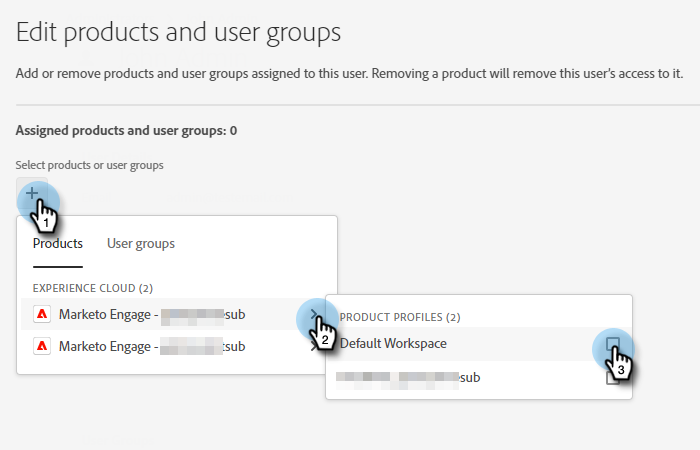

# 제품 관리자 추가 또는 제거 {#add-or-remove-a-product-admin}

>[!NOTE]
>
>**시스템** 관리자는 Adobe 조직 수준에서만 만들어집니다. 두 개 이상이 필요한 경우 [Marketo 지원](https://nation.marketo.com/t5/support/ct-p/Support)에 문의하십시오.

## 제품 관리자 추가 {#add-a-product-admin}

>[!IMPORTANT]
>
>Marketo Engage에 액세스하려면 제품 프로필에 관리자를 추가해야 합니다.

1. [Adobe Admin Console](https://adminconsole.adobe.com/){target="_blank"}에 로그인합니다.

   

1. **Marketo Engage**&#x200B;을 클릭합니다.

   

1. 원하는 구독을 선택합니다(둘 이상의 구독이 있는 경우).

   

1. **[!UICONTROL 관리자]** 탭을 클릭합니다.

   

1. **[!UICONTROL 관리자 추가]** 단추를 클릭합니다.

   

1. 추가하려는 관리자의 이메일 주소 또는 사용자 이름을 입력합니다. 이름과 성은 선택 사항입니다. **[!UICONTROL 저장]**&#x200B;을 클릭합니다.

   

1. 방금 추가한 관리자의 이름을 클릭합니다.

   

1. Products에서 세 점 메뉴를 클릭하고 **[!UICONTROL 편집]**&#x200B;을 선택합니다.

   

1. **+** 기호를 클릭합니다. 원하는 Marketo Engage 구독 옆에 있는 V자형 화살표를 클릭하고(둘 이상 있는 경우) 원하는 제품 프로필을 선택합니다.

   

1. **[!UICONTROL 저장]**&#x200B;을 클릭합니다.

   

그러면 사용자는 두 개의 이메일을 받게 됩니다. 첫 번째 이메일은 Marketo Engage에 대한 제품 관리자 권한이 부여되었음을 알려줍니다. 두 번째 이메일은 Marketo Engage에 로그인하도록 초대합니다.

>[!NOTE]
>
>제품 관리자 사용자가 Adobe Admin Console을 통해 Marketo Engage에 추가되면 사용자는 구독 내에서 Adobe 제품 관리자 역할이 부여됩니다.

## 관리자 제거 {#remove-a-user}

1. [Adobe Admin Console](https://adminconsole.adobe.com/){target="_blank"}에 로그인합니다.

   

1. **Marketo Engage**&#x200B;을 클릭합니다.

   

1. 원하는 구독을 선택합니다(둘 이상의 구독이 있는 경우).

   

1. **[!UICONTROL 관리자]** 탭을 클릭합니다.

   

1. 제거할 관리자를 선택하고 **[!UICONTROL 관리자 제거]** 단추를 클릭합니다.

   

1. 확인하려면 **[!UICONTROL 관리자 제거]**&#x200B;를 클릭하세요.

   

그러면 사용자는 더 이상 Marketo Engage에 대한 제품 관리자 액세스 권한이 없음을 알리는 이메일을 받게 됩니다.
