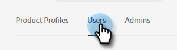
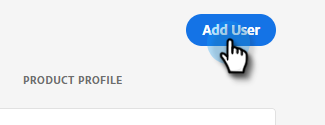
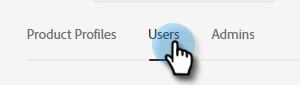

# 사용자 추가 또는 제거 {#add-or-remove-a-user}

## 사용자 추가 {#add-a-user}

1. [Adobe Admin Console](https://adminconsole.adobe.com/){target="_blank"}에 로그인합니다.

   

1. **Marketo Engage**&#x200B;을 클릭합니다.

   

1. 원하는 구독을 선택합니다(둘 이상의 구독이 있는 경우).

   

1. **[!UICONTROL 사용자]** 탭을 클릭합니다.

   

1. **[!UICONTROL 사용자 추가]** 단추를 클릭합니다.

   

1. 추가하려는 사용자의 이름, 사용자 그룹 또는 이메일 주소를 입력합니다. 이름과 성은 선택 사항입니다.

   

1. **+** 아이콘을 클릭하고 원하는 제품 프로필을 선택합니다.

   

   >[!IMPORTANT]
   >
   >Marketo Engage에 액세스하려면 제품 프로필에 _을(를) 추가해야_&#x200B;합니다.

1. **[!UICONTROL 저장]**&#x200B;을 클릭합니다.

   

그러면 Marketo Engage에 로그인하기 위한 이메일을 받게 됩니다.

>[!NOTE]
>
>사용자가 Adobe Admin Console을 통해 Marketo Engage에 추가되면 구독의 기본 작업 영역 내에서 &quot;표준 사용자&quot; 역할이 부여됩니다. 작업 영역 내에서 사용자의 역할을 조정해야 하는 경우 [여기에 설명된 대로 Marketo Engage에서 수행됩니다](/help/marketo/product-docs/administration/users-and-roles/managing-user-roles-and-permissions.md){target="_blank"}.

## 사용자 제거 {#remove-a-user}

>[!NOTE]
>
>사용자를 제거하려면 시스템 관리자여야 합니다.

1. [Adobe Admin Console](https://adminconsole.adobe.com/){target="_blank"}에 로그인합니다.

   

1. **Marketo Engage**&#x200B;을 클릭합니다.

   

1. 원하는 구독을 선택합니다(둘 이상의 구독이 있는 경우).

   

1. **[!UICONTROL 사용자]** 탭을 클릭합니다.

   

1. 제거할 사용자를 선택하고 **[!UICONTROL 제거]** 단추를 클릭합니다.

   

1. 확인하려면 **[!UICONTROL 사용자 제거]**&#x200B;를 클릭하세요.

   

그러면 사용자는 더 이상 Marketo Engage에 액세스할 수 없음을 알리는 이메일을 받게 됩니다.

>[!MORELIKETHIS]
>
>* [Adobe Admin Console 사용자](https://helpx.adobe.com/kr/enterprise/using/users.html){target="_blank"}
>* [개별적으로 사용자 관리](https://helpx.adobe.com/kr/enterprise/using/manage-users-individually.html){target="_blank"}
