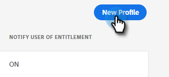

# 관리 설정 {#admin-setup}

Adobe 시스템 관리자로 추가되어 Adobe 조직에서 Marketo Engage을 하게 되면 초기 설정을 완료하기 위해 몇 가지 단계를 수행해야 합니다.

## 초기 설정 {#initial-setup}

1. Marketo Engage을 위한 지정된 시스템 관리자로 추가되면(신규 또는 설정된 조직) 환영 이메일을 받게 됩니다. 해당 이메일에서 **시작하기**.

   

1. 이전에 Adobe ID을 사용하여 애플리케이션에 액세스한 적이 있는 경우 Adobe Admin Console으로 바로 이동합니다. 그렇지 않으면, [Adobe ID 설정](https://helpx.adobe.com/manage-account/using/create-update-adobe-id.html){target=&quot;_blank&quot;}.

   

## 제품 프로필 만들기 {#create-a-product-profile}

시스템 관리자가 Admin Console에 액세스한 후 제품 프로필을 만들어야 합니다. 사용자/관리자가 Marketo Engage에 액세스하는 방법입니다.

1. 개요 페이지의 제품 및 서비스에서 **Marketo Engage**.

   

1. 원하는 구독을 선택합니다. 하나만 있는 경우 다음 단계로 건너뜁니다.

   

   >[!NOTE]
   >
   >여러 개의 구독이 있는 경우 각 구독 단계에 대해 수행해야 합니다.

1. 을(를) 클릭합니다. **새 프로필** 버튼을 클릭합니다.

   

1. 제품 프로필에 이름을 지정하고(표시 이름 및 설명은 선택 사항) **저장**.

   

>[!NOTE]
>
>여러 제품 프로필을 설정하는 경우 추가되는 프로필에 관계없이 Marketo에 동일한 액세스 권한을 사용자에게 갖게 됩니다.

>[!MORELIKETHIS]
>
>[제품 관리자 추가 또는 제거](/help/marketo/product-docs/administration/marketo-with-adobe-identity/add-or-remove-a-product-admin.md){target=&quot;_blank&quot;}
