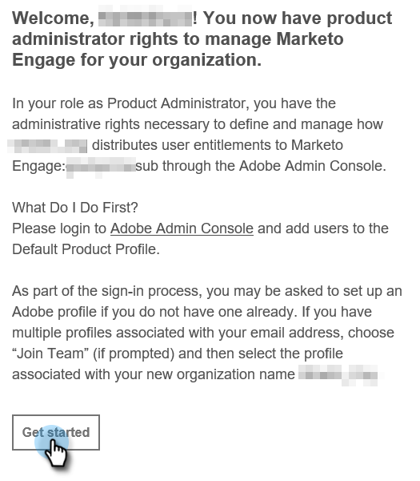

# 제품 관리자 설정 {#product-admin-setup}

1. 시스템 관리자가 초대하면 환영 이메일을 받게 됩니다. 해당 이메일에서 **시작하기**.

   

1. 이전에 Adobe ID을 사용하여 애플리케이션에 액세스한 적이 있는 경우 Adobe Admin Console으로 바로 이동합니다. 그렇지 않으면, [Adobe ID 설정](https://helpx.adobe.com/manage-account/using/create-update-adobe-id.html).

   

간단해! 제품 관리자는 주로 사용자를 추가할 책임이 있습니다. [여기에서 방법을 알아보십시오](/help/marketo/product-docs/administration/marketo-with-adobe-identity/add-or-remove-a-user.md#add-a-user).
