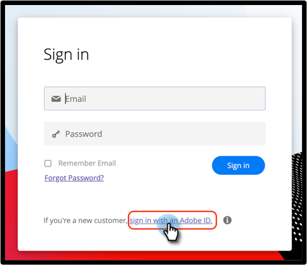

# Adobe ID로 사용자 로그인 {#user-sign-in-with-adobe-id}

Adobe ID를 가진 사용자가 Marketo Engage 애플리케이션에 로그인해야 하는 경우 Marketo Engage 로그인 페이지의 일반적인 로그인이 아닌 AdobeID 로그인 링크를 통해 로그인해야 합니다. 링크를 클릭하면 Marketo Engage 애플리케이션으로 이동합니다.

1. Marketo Engage 로그인 페이지에서 **[!UICONTROL Continue with AdobeID]**&#x200B;를 클릭합니다.

   

1. Adobe 자격 증명을 입력하고 **[!UICONTROL Continue]**&#x200B;를 클릭합니다.

   

로그인에 성공하면 Marketo Engage 애플리케이션으로 이동합니다.
