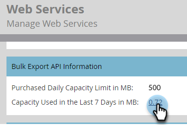

# 일괄 내보내기 API 정보 {#bulk-export-api-information}

지난 7일 동안 Marketo Engage 인스턴스에서 얼마나 많은 [대량 추출 API](https://experienceleague.adobe.com/en/docs/marketo-developer/marketo/rest/bulk-extract/bulk-extract){target="_blank"} 용량을 사용했는지 확인하는 방법을 알아봅니다.

>[!NOTE]
>
>추가 용량이 필요한 경우 계정 담당자에게 문의하십시오.

1. **[!UICONTROL Admin]** 영역으로 이동합니다.

   

1. **[!UICONTROL Web Services]**&#x200B;를 클릭합니다.

   

1. 아래로 스크롤하여 일괄 내보내기 API 정보 카드로 이동합니다. 일별/API 사용자당 사용량을 보려면 &quot;최근 7일&quot; 옆에 있는 숫자를 클릭합니다.

   

   

>[!NOTE]
>
>Marketo Engage 인스턴스에 대한 할당은 매일 오전 12:00(CST)에 재설정됩니다.
