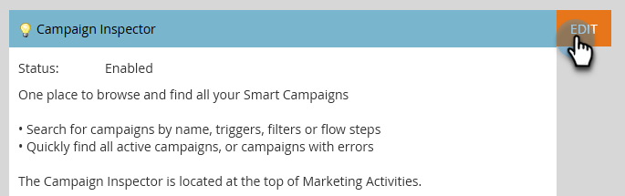

# 캠페인 검사자 {#campaign-inspector}

Campaign Inspector를 사용하여 한 곳에서 모든 스마트 캠페인을 보거나 검색할 수 있습니다.

## Campaign Inspector 활성화 {#enable-campaign-inspector}

1. **[!UICONTROL 관리자]** 영역으로 이동합니다.

   

1. **[!UICONTROL 보물 상자]**&#x200B;를 클릭합니다.

   

1. Campaign Inspector 옆에 있는 **[!UICONTROL 편집]**&#x200B;을 클릭합니다.

   

1. **[!UICONTROL 사용]** 확인란을 선택하고 **[!UICONTROL 저장]**&#x200B;을 클릭합니다.

   

   >[!NOTE]
   >
   >Campaign Inspector 탭이 활성화된 후 보려면 트리에서 원하는 작업 영역을 선택해야 합니다.

## Campaign Inspector 사용 {#using-campaign-inspector}

활성화되면 마케팅 활동 탭 옆에 캠페인 검사자 탭이 있습니다.

**[!UICONTROL 활성 캠페인]** 드롭다운을 클릭하여 다양한 캠페인 유형별로 필터링합니다.

페이지 하단에서 검색 창과 같은 유용한 도구에 액세스하거나 결과를 내보냅니다.

