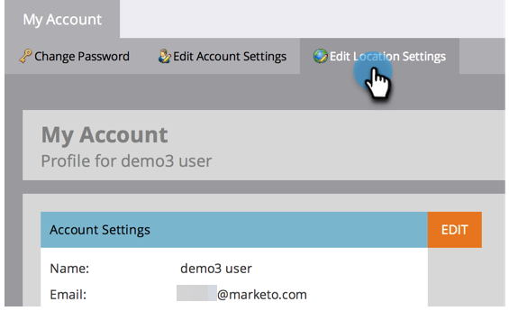

# 표준 시간대 변경 {#change-time-zone}

Marketo Engage 구독에서 시간대를 변경하는 방법을 알아봅니다.

1. **[!UICONTROL Admin]** 영역으로 이동합니다.

   

1. **[!UICONTROL My Account]**&#x200B;를 선택합니다.

   

1. **[!UICONTROL Edit Location Settings]** 탭을 클릭합니다.

   

1. 모달이 나타납니다. **[!UICONTROL Time zone]** 드롭다운을 클릭하고 선택합니다.

   

   >[!NOTE]
   >
   >_언어_ 및 _로케일_&#x200B;은(는) [Adobe 계정 프로필](https://account.adobe.com/kr/profile){target="_blank"}에서 액세스해야 하므로 회색으로 표시됩니다.

1. **[!UICONTROL Save]**&#x200B;를 클릭합니다.
