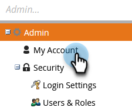
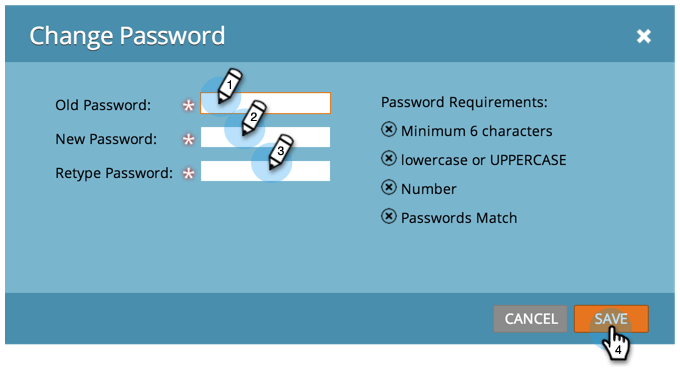

# Marketo 암호 변경 {#change-your-marketo-password}

다음과 같은 간단한 단계를 통해 Marketo 암호를 변경합니다.

1. **[!UICONTROL Admin]** 영역으로 이동합니다.

   

1. **[!UICONTROL My Account]**&#x200B;를 클릭합니다.

   

1. **[!UICONTROL Change Password]**&#x200B;를 클릭합니다.

   

1. 이전 암호와 새 암호를 입력한 다음 **[!UICONTROL Save]**&#x200B;을(를) 클릭합니다.

   

   >[!NOTE]
   >
   >업데이트할 때 암호 요구 사항을 적어 두십시오.
