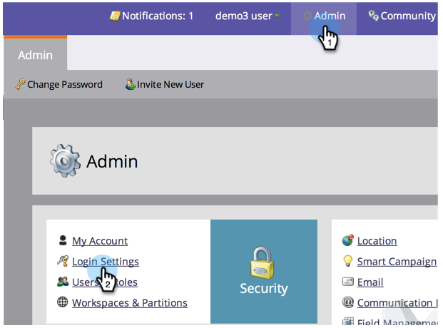

# 암호 보안 설정 변경 {#change-your-password-security-settings}

구독의 암호 정책을 제어합니다. 방법

>[!NOTE]
>
>**관리자 권한 필요**

1. **관리**&#x200B;에서 **로그인 설정**&#x200B;을 클릭합니다.

   

1. **보안 설정**&#x200B;에서 **편집**&#x200B;을 클릭합니다.

   

1. **템플릿**&#x200B;을 선택합니다. 고급 옵션을 보려면 **고급** 드롭다운을 클릭합니다.

   >[!NOTE]
   >
   >템플릿은 미리 작성된 구성일 뿐입니다. 표준이 좋습니다. 보안이 가장 강력합니다. 사용자 지정 기능을 사용하면 자신만의 스타일을 만들 수 있습니다.

   

   >[!TIP]
   >
   >**사용자 지정**&#x200B;에서 사용자가 암호를 만들 때 포함할 특성을 나타내려면 상자를 선택합니다.

1. **만료**&#x200B;을 설정합니다. 이 기능은 사용자가 특정 시간 후에 암호를 재설정해야 합니다. 여기에는 관리자 사용자도 포함됩니다.

   >[!CAUTION]
   >
   >기존 사용자에게 변경 내용이 통보되지 않습니다. 모든 사용자가 새 설정을 업데이트하도록 하려면 먼저 **만료**&#x200B;을 30일로 설정한 다음 다시 원래 패턴으로 변경합니다.

   

1. **비활성 세션 시간 초과**&#x200B;를 설정합니다. 사용자가 Marketing To에 다시 로그인해야 하기 전에 얼마나 오랫동안 비활성화할 수 있는지 결정합니다.

   

   보안이 중요한 비즈니스 우리가 도와줄게
