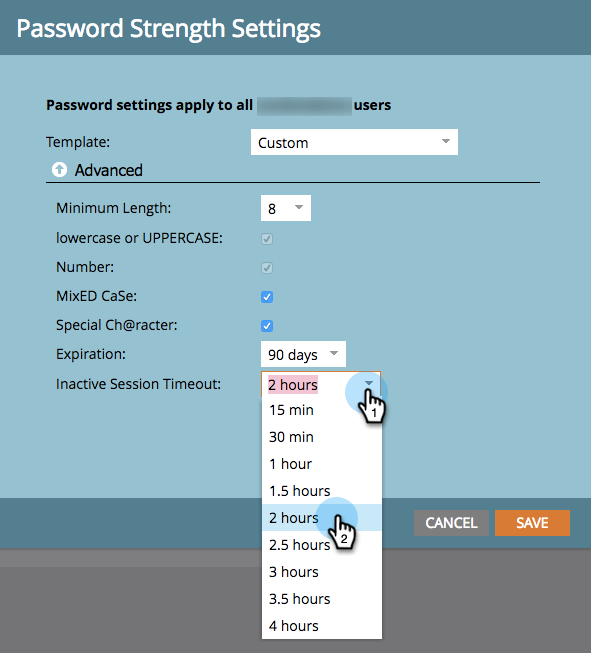

# 암호 보안 설정 변경 {#change-your-password-security-settings}

구독의 암호 정책을 제어합니다. 방법은 다음과 같습니다.

>[!NOTE]
>
>**관리자 권한 필요**

1. **[!UICONTROL Admin]** 영역으로 이동합니다.

   

1. **[!UICONTROL Login Settings]**&#x200B;을(를) 클릭합니다.

   

1. **[!UICONTROL Security Settings]**&#x200B;에서 **[!UICONTROL Edit]**&#x200B;을(를) 클릭합니다.

   

1. **[!UICONTROL Template]** 선택. 고급 옵션을 보려면 **[!UICONTROL Advanced]** 드롭다운을 클릭하십시오.

   

   >[!NOTE]
   >
   >템플릿은 단지 사전 설치된 구성일 뿐입니다. **[!UICONTROL Standard Security]**&#x200B;이(가) 좋습니다. **[!UICONTROL High Security]**&#x200B;이(가) 가장 강합니다. **[!UICONTROL Custom]**&#x200B;을(를) 통해 직접 만들 수 있습니다.

   >[!TIP]
   >
   >**[!UICONTROL Custom]**&#x200B;에서 사용자가 암호를 만들 때 포함할 특성을 나타내는 확인란을 선택합니다.

1. **[!UICONTROL Expiration]**&#x200B;을(를) 설정합니다. 이 기능을 사용하려면 사용자가 일정 시간 후 암호를 자동으로 재설정해야 합니다. 여기에는 관리 사용자도 포함됩니다.

   

   >[!CAUTION]
   >
   >기존 사용자에게는 변경 사항이 통지되지 않습니다. 먼저 **[!UICONTROL Expiration]**&#x200B;을(를) 30일로 설정하여 모든 사용자가 새 설정으로 업데이트되었는지 확인한 다음 원래 케이던스로 다시 변경합니다.

1. **[!UICONTROL Inactive Session Timeout]**&#x200B;을(를) 설정합니다. 이렇게 하면 사용자가 Marketo에 다시 로그인하기 전까지의 비활성화 기간을 결정합니다.

   
