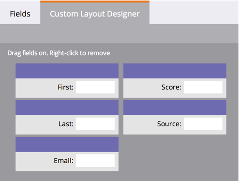

# 개인 세부 사항 페이지에 대한 사용자 정의 탭 만들기 {#creating-a-custom-tab-for-the-person-detail-page}

사람 세부 정보에 있는 특정 필드 세트를 계속 찾고 있는 경우 사용자 정의 레이아웃을 만들어 보다 쉽게 만드는 것이 좋습니다.

1. **관리**&#x200B;로 이동하고 **필드 관리**&#x200B;를 클릭합니다.

   

1. **사용자 지정 레이아웃 디자이너** 탭을 클릭합니다.

   

1. 추가할 필드를 찾은 다음 캔버스로 드래그하여 놓습니다.

   

1. 원하는 방식으로 레이아웃을 작성할 때까지 필드를 계속 추가합니다.

   

   >[!NOTE]
   >
   >2개의 열이 있습니다.

   필드를 제거하려는 경우 제거할 필드를 마우스 오른쪽 단추로 클릭하고 **삭제**&#x200B;를 클릭합니다.

   

   멋진 작품! 이제 개인의 세부 사항을 로드할 때 사용자 정의 레이아웃을 사용하여 중요한 정보에 액세스할 수 있습니다.

   
