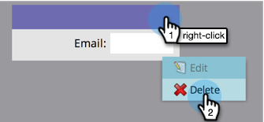

# 개인 세부 정보 페이지에 대한 사용자 정의 탭 만들기 {#creating-a-custom-tab-for-the-person-detail-page}

개인 세부 정보에서 특정 필드 세트를 반복해서 찾고 있는 경우 작업을 더 쉽게 할 수 있도록 사용자 정의 레이아웃을 만드는 것이 좋습니다.

1. **[!UICONTROL Admin]** 영역으로 이동합니다.

   

1. **[!UICONTROL Field Management]**&#x200B;을(를) 클릭합니다.

   

1. **[!UICONTROL Custom Layout Designer]** 탭을 클릭합니다.

   

1. 추가할 필드를 찾은 다음 캔버스로 드래그하여 놓습니다.

   

1. 원하는 레이아웃이 나타날 때까지 필드를 계속 추가합니다.

   

   >[!NOTE]
   >
   >작업할 열이 두 개 있습니다.

   필드를 제거하려면 제거할 필드를 마우스 오른쪽 단추로 클릭하고 **[!UICONTROL Delete]**&#x200B;을(를) 클릭합니다.

   

   멋진 작품이야! 이제 개인의 세부 정보를 로드할 때 사용자 정의 레이아웃을 사용하여 중요한 정보에 액세스할 수 있습니다.

   
