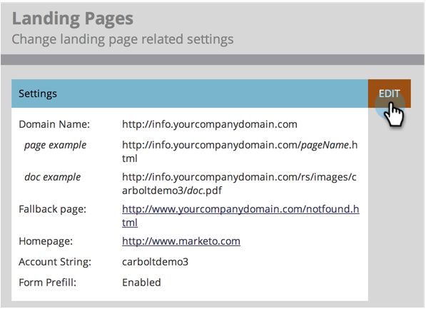

# CNAME으로 랜딩 페이지 URL 사용자 지정  {#customize-your-landing-page-urls-with-a-cname}

Marketo이 랜딩 페이지를 호스트하더라도 회사에 맞게 URL을 사용자 정의해야 합니다.

>[!NOTE]
>
>CNAME 없음:
>
>https://na-sj02.marketo.com/lp/mktodemoaccount126/UnsubscribePage.html
>
>브랜드 CNAME:
>
>https://go입니다.**귀사**.com/UnsuscribePage.html

>[!NOTE]
>
>**관리자 권한 필요**

준비시켜 놓겠습니다!

1. CNAME을 선택합니다.

   URL의 앞부분입니다. 예:

   * **이동**.YourCompany.com/NameOfPage.html
   * **정보**.YourCompany.com/NameOfPage.html
   * **페이지**.YourCompany.com/NameOfPage.html

   한 단어(더하기 YourCompany.com)를 CNAME이라고 합니다. 나중에 필요하니 메모해 두십시오.

1. 계정 문자열을 찾습니다.

1. 로 이동 **[!UICONTROL 관리자]** 영역입니다.

   

1. 클릭 **[!UICONTROL 랜딩 페이지]**.

   

1. 아래 **[!UICONTROL 랜딩 페이지]** 탭에서 설정 섹션의 계정 문자열을 복사합니다.

   

1. 이것도 나중에 필요하니 메모해 두십시오.

1. IT에 요청을 보냅니다.

1. IT 직원에게 다음 CNAME을 설정하도록 요청(단어 바꾸기) [CNAME] 및 [계정 문자열] (이전 단계의 텍스트 포함):

   [CNAME].YourCompany.com > [계정 문자열].mktoweb.com

1. CNAME 설정을 완료합니다.

1. IT에서 CNAME을 생성했으면 **[!UICONTROL 관리자]** 영역입니다.

   

1. 클릭 **[!UICONTROL 랜딩 페이지]**.

   

1. 아래 **[!UICONTROL 설정]** 섹션, 클릭 **[!UICONTROL 편집]**.

   

1. 에 CNAME 입력 **[!UICONTROL 랜딩 페이지의 도메인 이름]**, 다음을 입력합니다. **[!UICONTROL 대체 페이지]**, 다음을 입력합니다. **[!UICONTROL 홈페이지]**, 및 클릭 **[!UICONTROL 저장]**.

   

Marketo 랜딩 페이지를 사용할 수 없는 경우 대체 페이지에서 사용자가 리디렉션되는 위치입니다.

잘했어! 이제 랜딩 페이지의 브랜드가 회사 도메인으로 지정되었습니다.
