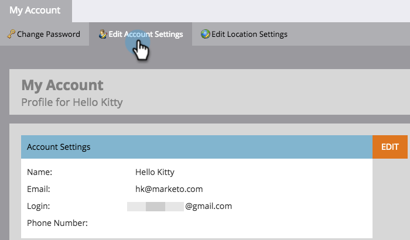

# 계정 설정 편집 {#edit-account-settings}

계정 이메일 주소, 이름 또는 전화 번호를 변경해야 합니까? 아래에서 방법을 알아보십시오.

>[!NOTE]
>
>**관리자 권한 필요**

1. **[!UICONTROL Admin]** 영역으로 이동합니다.

   

1. **[!UICONTROL My Account]**&#x200B;를 선택합니다.

   

1. **[!UICONTROL Edit Account Settings]**&#x200B;를 선택합니다.

   

1. 편집하고 **[!UICONTROL Save]**&#x200B;을(를) 클릭합니다.

   
