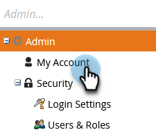

# 구독 설정 편집 {#edit-subscription-settings}

여러 Marketo 구독에 액세스할 수 있고 사용 중인 구독을 확인하려면 각 구독에 고유한 이름을 지정하십시오. 그러면 구독 페이지 상단에 해당 이름이 표시됩니다.

예를 들어 프로덕션 인스턴스와 샌드박스 인스턴스 둘 다에서 작업하는 경우 한 구독의 이름을 **Marketo 프로덕션**, 다른 **Marketo 샌드박스**&#x200B;로 지정할 수 있습니다.

1. **[!UICONTROL 관리자]**(으)로 이동합니다.

   

1. **[!UICONTROL 내 계정]**&#x200B;을 클릭합니다.

   

1. **[!UICONTROL 구독 정보 편집]**&#x200B;을 클릭합니다.

   

1. 편집하고 **[!UICONTROL 저장]**&#x200B;을 클릭합니다.

   
