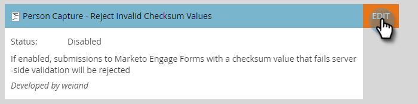

# 스팸 양식 제출 차단 방법 {#how-to-block-spam-form-submissions}

종종 체크섬이 잘못되었거나 누락된 양식 제출(일반적으로 봇의 경우)을 통해 잘못된 통계를 생성할 수 있습니다. 이를 방지하는 방법

>[!CAUTION]
>
>이 기능은 프로그래머틱 POST를 사용하여 수행된 양식 제출을 leadCapture/save2 종단점으로 거부합니다. 해당 방법으로 Marketo에 양식을 제출하는 통합을 활용한다면 이 기능을 통해 이러한 제출이 차단됩니다. leadCapture/save2를 API로 사용하거나 프로그래밍 방식의 양식 제출 작업을 직접 수행하는 것은 지원되지 않으며 금지되어 있습니다. 다음 방법을 사용하여 비즈니스만 양식을 제출합니다.양식 자산, 포함된 양식 코드, Forms2.js API 또는 Submit Form REST API.

1. **관리**&#x200B;를 클릭합니다.

   

1. **보물상자**&#x200B;를 클릭합니다.

   

1. **사람 캡처 - 잘못된 체크섬 값 거부** 옆에서 **편집**&#x200B;을 클릭합니다.

   

1. **활성화됨** 확인란을 선택하고 **저장**&#x200B;을 클릭합니다.

   

>[!NOTE]
>
>이 기능을 활성화하면 잘못된 숫자가 필터링되어 양식 활동이 감소할 수 있습니다.
