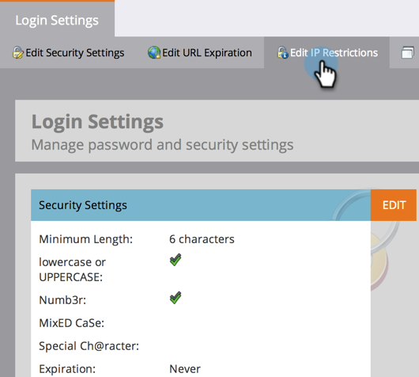

# IP {#restrict-marketo-logins-based-on-ip}에 따라 마케팅 로그인 제한

사용자가 자신의 IP 주소를 기반으로 Marketing To에 액세스하도록 제한하거나 활성화할 수 있습니다. 방법

>[!NOTE]
>
>**관리자 권한 필요**

>[!NOTE]
>
>이 문서의 정보는 login.marketing.com의 직접 로그인에만 적용됩니다. 현재 SSO(Single Sign-On) 로그인에 대해 IP 제한을 적용할 수 없습니다.

1. **관리**&#x200B;에서 **로그인 설정**&#x200B;을 클릭합니다.

   

1. **IP 제한 편집**&#x200B;을 클릭합니다.

   

1. **허용 ** 또는 **블록** 특정 주소를 선택할 것인지 선택하고 주소를 입력한 다음 **저장**&#x200B;을 클릭합니다.

   >[!NOTE]
   >
   >**정의**
   >
   >    
   >    
   >    * **허용된 IP 주소**:허용되는 IP 주소 추가가 포함됩니다. 지정된 모든 IP 주소가 포함되고 다른 모든 주소는 제외됩니다.
   >    * **블록 IP 주소**:특정 IP가 Marketing To에 액세스하지 못하도록 합니다.
   >    * **IP 제한** 비활성화:이 옵션을 선택하면 모든 제한 규칙이 작동하지 않습니다. 테스트 목적으로 사용합니다.

   >[!NOTE]
   >
   >
   >여러 제한을 추가할 수 있지만 모두 허용되거나 모두 차단만 할 수 있습니다. 허용 및 차단된 항목을 혼합하거나 일치시킬 수 없습니다.

   

   잘 해냈습니다. 마케팅 데이터가 이전보다 훨씬 안전해졌습니다.

