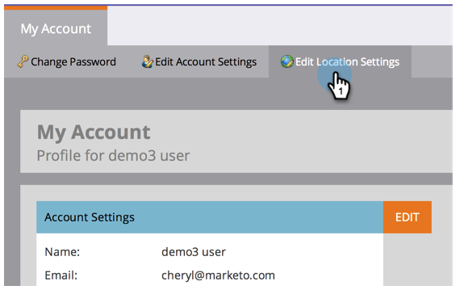

# 언어, 로케일 및 시간대 {#select-your-language-locale-and-time-zone} 선택

영어가 제1외국어가 아닌가요? 걱정하지 마십시오. 우리는 당신이 알아서 합니다. 언어, 로케일 및 시간대를 변경하는 방법을 설명합니다.

## 지원되는 언어 {#supported-languages}

* 영어
* 프랑스어
* 독일어
* 일본어
* 포르투갈어
* 스페인어

## 사용자 언어, 로케일 및 시간대 변경 {#change-user-language-locale-and-time-zone}

1. Marketing에 로그인하고 사용자 이름 아래에서 [내 계정]을 선택합니다.

   

1. 내 계정에서 위치 설정 편집을 클릭합니다.

   

1. 언어 변경을 참조하십시오.

   

   >[!TIP]
   >
   >로그인 페이지의 상단에 있는 언어 드롭다운을 클릭하여 언어만 변경할 수도 있습니다.

1. 로케일을 변경합니다.

   

1. 시간대 변경.

   

1. 저장을 클릭합니다.

   

잘했어! 브라우저가 새로 고침되고 변경 내용이 반영된 것을 볼 수 있습니다.

