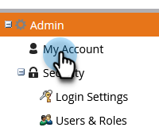

# 언어, 로케일 및 시간대 선택 {#select-your-language-locale-and-time-zone}

영어는 모국어가 아닙니까? 걱정하지 마십시오. 이미 해결했습니다. 다음은 Marketo Engage 인스턴스의 언어, 로케일 및 시간대를 변경하는 방법입니다.

>[!IMPORTANT]
>
>이 문서는 다음을 수행하는 사람만을 위한 것입니다. _아님_ 사용 [Adobe ID가 있는 Marketo](/help/marketo/product-docs/administration/marketo-with-adobe-identity/adobe-identity-management-overview.md). 이 옵션을 선택하면 아래에 설명된 설정에 액세스할 수 있습니다. [Adobe 계정 프로필](https://account.adobe.com/profile).

## 지원되는 언어 {#supported-languages}

* 영어
* 프랑스어
* 독일어
* 일본어
* 포르투갈어
* 스페인어

## 사용자 언어, 로케일 및 시간대 변경 {#change-user-language-locale-and-time-zone}

1. 로 이동 **[!UICONTROL 관리자]** 영역입니다.

   

1. 선택 **[!UICONTROL 내 계정]**.

   

1. 내 계정에서 **[!UICONTROL 위치 설정 편집]**.

   

1. 변경 **[!UICONTROL 언어]**.

   

   >[!TIP]
   >
   >로그인 페이지 상단에 있는 언어 드롭다운을 클릭하여 언어만 변경할 수도 있습니다.

1. 변경 **[!UICONTROL 로케일]**.

   

1. 변경 **[!UICONTROL 시간대]**.

   

1. **[!UICONTROL 저장]**&#x200B;을 클릭합니다.

   

잘했어! 브라우저가 새로 고침되고 변경 사항이 반영됩니다.

