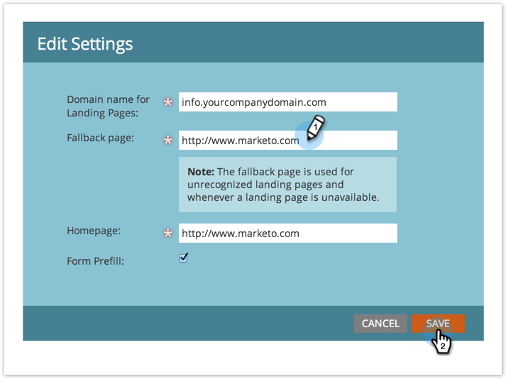

# 대체 페이지 {#set-a-fallback-page} 설정

랜딩 페이지가 오프라인 상태이거나 찾을 수 없는 경우 폴백 페이지는 최종 방어 상태입니다. 꼭 하나 가지고 계세요

>[!NOTE]
>
>**관리자 권한 필요**

1. **관리**&#x200B;에서 **랜딩 페이지**&#x200B;를 클릭합니다.

   

1. **랜딩 페이지** 탭에서 **편집**&#x200B;을 클릭합니다.

   

1. 대화 상자에 **폴백 페이지**&#x200B;를 입력하고 **저장**&#x200B;을 클릭합니다.

   

불라! 폴백 페이지를 방금 추가했습니다! 404페이지가 더 이상 없습니다.
