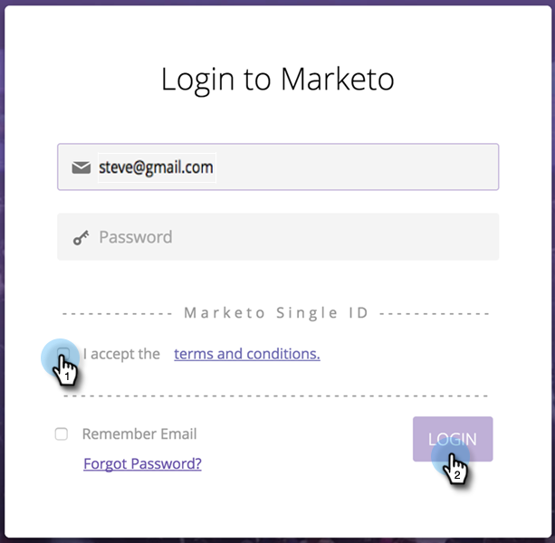

# 구독 로그인에 범용 ID 사용 {#using-a-universal-id-for-subscription-login}

범용 ID를 사용하면 한 번의 로그인으로 여러 Marketing To 구독에 액세스할 수 있고 구독 간을 신속하게 전환할 수 있습니다. 원하는 경우 사용료 지불 옵션에 다른 로그인을 사용할 수 있습니다.

Universal ID를 사용하더라도 각 개인 구독에 대한 지원 티켓을 만들 수 있습니다.

구독 수준 설정은 역할, 권한 및 암호 정책 등 유니버설 ID를 사용하는 사용자에게 적용됩니다. 사용자 프로필 수준 변경 사항은 모든 구독(예: 이름, 성 및 이메일 주소)에 반영됩니다.

## 범용 ID 설정 {#setting-up-a-universal-id}

각각의 개별 인스턴스에서 Marketing To 관리자는 동일한 로그인으로 각 서로 다른 구독으로 귀하를 초대해야 합니다. 기존 로그인을 자동으로 병합할 수 없습니다. 유니버설 ID를 활성화하면 최대 30분 동안 마케팅 **인스턴스를 사용할 수** 없습니다. 사용자 기반이 더 큰 경우 좀 더 길어질 수 있습니다.

>[!CAUTION]
>
>사용자에 대해 단일 ID 또는 유니버설 ID가 활성화된 경우 처음 설정한 후에는 해당 역할 및 작업 영역을 편집할 수 **없습니다** .

>[!NOTE]
>
>여러 개의 구독 로그인 ID가 있는 경우 여러 커뮤니티 프로필이 있을 수도 있습니다. 사용하려는 프로파일과 연결된 범용 ID에 대한 ID를 선택해야 하며 이는 샌드위치가 아니라 프로덕션 인스턴스용이어야 합니다.

## 로그인 {#logging-in}

범용 ID를 사용하여 두 번째 가입에 대한 초대를 수락하기 위해 로그인하면 옵트인 로그인 페이지가 표시됩니다. 여기에서 약관에 동의하려면 확인란을 선택해야 합니다. 수락하면 이후 로그인 시 이 페이지가 아닌 일반 재설정 페이지가 표시됩니다. 약관에 동의하면 Marketing에서 기본 프로필 데이터(이름, 성 및 이메일 주소 등)를 구독이 호스팅되는 다른 위치의 데이터 센터에 배포할 수 있습니다.

>[!TIP]
>
>구독 관리자가 삭제하지 않는 이상 더 이상 사용하지 않는 ID는 유지됩니다. 예를 들어 자신에게 할당된 비공개 보고서가 있는 경우 해당 ID를 사용해서만 액세스할 수 있도록 유지하는 것이 좋습니다. 이 경우 이러한 비공개 보고서를 새 유니버설 ID로 이동한 다음 기존 ID를 삭제하는 것이 적절합니다.

## 암호 {#passwords}

여러 구독을 위한 범용 ID를 사용하는 Marketing To는 가장 엄격한 암호 정책을 자동으로 적용합니다. 예를 들어 일부 구독에 최소 암호 길이가 필요하고 다른 구독에는 그렇지 않은 경우 모든 구독에 최소 길이가 적용됩니다.

여러 구독을 위한 범용 ID를 사용하는 경우 암호만 변경할 수 있습니다.

>[!NOTE]
>
>현재 구독의 암호가 초대받는 두 번째 구독의 암호 정책을 준수하지 않는 경우 Universal ID를 사용하려는 사용자에게 암호를 재설정하도록 요청합니다.

## 구독 간 전환 {#switching-between-subscriptions}

범용 ID를 사용하면 로그인한 구독을 확인하고 로그인 액세스 권한이 있는 다른 구독을 선택할 수 있습니다. 대부분의 경우 로그아웃했다가 다시 로그인하지 않고도 전환할 수 있습니다.

로그아웃했다가 다시 로그인하면 Marketing To에서 마지막으로 로그인한 구독에 자동으로 로그인됩니다. 그런 다음 필요한 경우 다른 구독으로 전환할 수 있습니다.

## 커뮤니티 프로필 {#community-profiles}

여러 번 구독하는 경우 여러 커뮤니티 프로필이 있을 수 있습니다. 가장 활성화된 커뮤니티 프로필과 연결된 로그인을 선택하는 것이 좋습니다.

## 모바일 플랫폼 {#mobile-platform}

Universal ID를 사용하는 사용자는 마지막으로 로그인한 구독의 Marketing To Moment 및 iPad 이벤트 체크인 응용 프로그램에서 자신의 데이터를 볼 수 있습니다. 모바일 플랫폼 자체에서는 구독을 변경할 수 없습니다.

