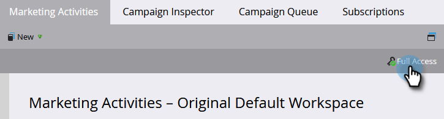

# 보유하고 있는 권한 확인 {#find-out-what-permissions-you-have}

Marketo에 어떤 권한이 있는지 모르면 쉽게 확인할 수 있습니다.

1. 이동 **마케팅 활동**.

   

1. 클릭 **전체 액세스** 사용 권한을 확인합니다.

   

나열된 권한이 표시됩니다.

활성화되는 권한이 필요한 경우 Marketo 관리자에게 문의하십시오.
