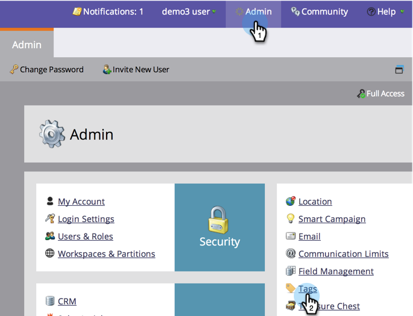

# 프로그램 채널 {#create-a-program-channel} 만들기

프로그램은 특정 마케팅 이니셔티브입니다. 이 채널은 웨비나, 스폰서 또는 온라인 광고와 같은 전달 메커니즘입니다.

>[!NOTE]
>
>**관리자 권한 필요**

>[!NOTE]
>
>Marketing To에서 가장 중요한 요소인 [프로그램](/help/marketo/product-docs/core-marketo-concepts/programs/creating-programs/understanding-programs.md)에 대해 자세히 알아보십시오.

1. **관리** 섹션에서 **태그**&#x200B;를 클릭합니다.

   

   >[!NOTE]
   >
   >태그를 사용해야 하는 이유 채널은 다른 태그와 마찬가지로 프로그램을 설명하는 방법입니다. 이 채널에는 특별한 추가 기능이 있습니다.

1. 기존 채널을 확장하고 보려면 **채널** 옆에 있는 **+** 기호를 클릭합니다.

   

1. **새로 만들기**&#x200B;에서 **새 채널**&#x200B;을 클릭합니다.

   

   >[!NOTE]
   >
   >**예**
   >
   >채널:빌보드
   >
   >* 적용 대상:기본값
   >* 진행:구성원, 참여(확실하지 않은 경우 이 작업은 문제 없음)
   >* 성공:참여

   >
   >채널:파티
   >
   >* 적용 대상:이벤트
   >* 진행:초대됨, 등록됨, 표시 및 참석 안 함
   >* 성공:참석한 사람

   >
   >기존 채널의 진행 상태를 확인하여 이를 사용하는 방법에 대해 알아보십시오.

1. 자, 채널 예를 살펴보겠습니다. 새 **채널**&#x200B;의 이름을 지정하고 적용할 프로그램 유형을 선택합니다.

   

   >[!NOTE]
   >
   >뭘 신청해요? 프로그램에는 여러 종류가 있다. 채널을 올바른 유형과 일치시킵니다. 확실하지 않은 경우 **기본값**&#x200B;을 선택합니다.

   >[!NOTE]
   >
   >&quot;웨비나와 함께 이벤트&quot;를 사용하는 경우 시스템 매핑이 잠기므로(웨비나 통합에서 필요에 따라) 편집할 수 없습니다.

   처음 2개의 프로그램 상태 이름을 입력한 다음 단계 추가를 클릭합니다.
   

1. 다른 프로그램 **상태** 및 **단계** 번호를 입력한 다음 **단계 추가**&#x200B;를 클릭합니다.

   

   >[!TIP]
   >
   >**단계** 번호는 프로그램 상태를 정렬하는 데 사용됩니다. 이러한 진행 단계에서는 사람들이 뒤로 물러설 수 없다는 것을 명심하라. 상태는 더 높거나 같은 값 상태로만 변경할 수 있습니다. 진행 상태에 반대되는 상태로 전환하려는 경우 동일한 값을 사용합니다.

1. 마지막 프로그램 **상태** 및 **단계** 번호를 입력합니다.

   

   >[!NOTE]
   >
   >&quot;이벤트&quot; 유형을 사용할 때는 [등록됨], [대기 목록] 및 [참석자] 상태에 대한 시스템 매핑이 필요합니다. 따라서 이러한 상태를 숨길 수 없습니다.

1. **등록됨**&#x200B;에 대해 **모바일 체크인 상태**&#x200B;를 선택합니다.

   

1. **참석한**&#x200B;의 **모바일 체크인 상태**&#x200B;를 선택합니다.

   

   >[!NOTE]
   >
   >**모바일 체크인 상태**** ** 옵션은 채널이 이벤트 프로그램용인 경우에만 사용할 수 있습니다.

   >[!NOTE]
   >
   >[모바일 체크인 앱](/help/marketo/product-docs/core-marketo-concepts/mobile-apps/event-check-in/event-check-in-overview.md)에 **등록된** 및 **참석한**&#x200B;의 **모바일 체크인 상태를 가진 사람만 표시됩니다.**

   >[!TIP]
   >
   >모바일 체크인 앱에서 새 사람을 만든 경우 이벤트 프로그램에서 등록됨으로 설정됩니다. 앱에서 이벤트에 체크 인된 사람은 이벤트 프로그램에서 참석으로 설정됩니다.

1. **성공** 프로그램 상태를 선택한 다음 **만들기**&#x200B;를 클릭합니다.

   

   잘했다! 해당 유형의 새 프로그램을 만들면 이 새 채널이 선택 항목 중 하나가 됩니다.
