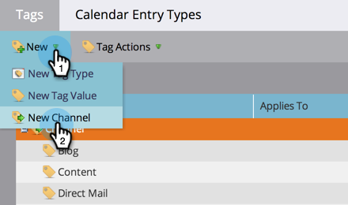

# 프로그램 채널 만들기 {#create-a-program-channel}

프로그램은 하나의 특정 마케팅 이니셔티브입니다. 이 채널은 웨비나 후원 또는 온라인 광고와 같은 게재 메커니즘으로 설계되었습니다.

>[!NOTE]
>
>**관리자 권한 필요**

>[!NOTE]
>
>Marketo에서 가장 중요한 요소인 [프로그램](/help/marketo/product-docs/core-marketo-concepts/programs/creating-programs/understanding-programs.md)에 대해 자세히 알아보세요.

1. **[!UICONTROL Admin]** 영역으로 이동합니다.

   

1. **[!UICONTROL Tags]**&#x200B;를 클릭합니다.

   

   >[!NOTE]
   >
   >태그를 사용해야 하는 이유 채널은 다른 태그와 마찬가지로 프로그램을 설명하는 방법입니다. 이 채널에는 특별한 기능이 있습니다.

1. **옆에 있는**+[!UICONTROL Channel] 기호를 클릭하여 확장하고 기존 채널을 확인합니다.

   

1. **[!UICONTROL New]**&#x200B;에서 **[!UICONTROL New Channel]**&#x200B;을(를) 클릭합니다.

   

   >[!NOTE]
   >
   >**예**
   >
   >채널: 빌보드
   >
   >* 적용 대상: 기본값
   >* 진행: 멤버, 참여(확실하지 않은 경우 제대로 작동함)
   >* 성공: 참여
   >
   >채널: 파티
   >
   >* 적용 대상: 이벤트
   >* 진행: 초대됨, 등록됨, 표시 없음 및 참석됨
   >* 성공: 출석함
   >
   >기존 채널의 진행 상황을 확인하여 사용 방법에 대한 아이디어를 얻을 수 있습니다.

1. 파티 채널 예를 살펴보겠습니다. 새 **[!UICONTROL Channel]** 이름을 지정하고 적용할 프로그램 유형을 선택하십시오.

   

   >[!NOTE]
   >
   >무엇을 적용하시겠습니까? 프로그램에는 몇 가지 유형이 있습니다. 채널을 적절한 유형에 일치시키십시오. 확실하지 않은 경우 **[!UICONTROL Default]**&#x200B;을(를) 선택하십시오.

   >[!NOTE]
   >
   >&quot;[!UICONTROL Event with Webinar]&quot;을(를) 사용하는 경우 시스템 매핑이 잠기고(웨비나 통합에 필요한 경우) 편집할 수 없습니다.

1. 처음 두 프로그램 상태 이름을 입력한 다음 **[!UICONTROL Add Step]**&#x200B;을(를) 클릭합니다.

   

1. 다른 프로그램 **[!UICONTROL Status]** 및 **[!UICONTROL Step]** 번호를 입력한 다음 **[!UICONTROL Add Step]**&#x200B;을(를) 클릭합니다.

   

   >[!TIP]
   >
   >**[!UICONTROL Step]** 숫자는 프로그램 상태를 정렬하는 데 사용됩니다. 이러한 진행 단계에서 사람들이 뒤로 갈 수 없다는 점을 명심하십시오. 상태를 더 높거나 동일한 값 상태로만 변경할 수 있습니다. 상태가 진행이 아니라 앞뒤로 전환되어야 하는 경우 동일한 값을 사용합니다.

1. 마지막 프로그램 **[!UICONTROL Status]** 및 **[!UICONTROL Step]** 번호를 입력하십시오.

   

   >[!NOTE]
   >
   >&quot;[!UICONTROL Event]&quot; 유형을 사용하는 경우 등록됨, 대기자 명단 및 참석됨 상태에 대한 시스템 매핑이 필요합니다. 따라서 이러한 상태는 숨길 수 없습니다.

1. **[!UICONTROL Mobile Check-in Status]**&#x200B;에 대해 **[!UICONTROL Registered]**&#x200B;을(를) 선택하십시오.

   

1. **[!UICONTROL Mobile Check-in Status]**&#x200B;에 대해 **[!UICONTROL Attended]**&#x200B;을(를) 선택하십시오.

   

   >[!NOTE]
   >
   >이벤트 프로그램에 채널이 사용되는 경우에만 **[!UICONTROL Mobile Check-in Status]** 옵션을 사용할 수 있습니다.

   >[!NOTE]
   >
   >**[!UICONTROL Mobile Check-in Status]**/**[!UICONTROL Registered]** 및 **[!UICONTROL Attended]**&#x200B;을(를) 가진 사람만 [모바일 체크인 앱](/help/marketo/product-docs/core-marketo-concepts/mobile-apps/event-check-in/event-check-in-overview.md)에 표시됩니다.

   >[!TIP]
   >
   >모바일 체크인 앱에서 새 사용자를 만들면 이벤트 프로그램에서 [!UICONTROL Registered]&#x200B;(으)로 설정됩니다. 사용자가 앱에서 이벤트에 체크 인되면 이벤트 프로그램에서 [!UICONTROL Attended]&#x200B;(으)로 설정됩니다.

1. **[!UICONTROL Success]** 프로그램 상태를 선택한 다음 **[!UICONTROL Create]**&#x200B;을(를) 클릭합니다.

   

   잘했어! 해당 유형의 새 프로그램을 만들 때 이 새 채널이 선택 사항 중 하나가 됩니다.
