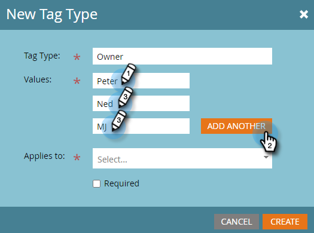

# 사용자 지정 태그 만들기 {#create-custom-tags}

태그는 프로그램을 구성하는 데 도움이 되며, 채널은 보고 목적으로 데이터를 수집하는 데 도움이 됩니다.

>[!NOTE]
>
>자세한 내용은 [태그 이해](/help/marketo/product-docs/core-marketo-concepts/programs/working-with-programs/understanding-tags.md)를 확인하세요.

>[!NOTE]
>
>**관리자 권한 필요**

## 새 태그 유형 만들기 {#create-a-new-tag-type}

새 태그 유형을 만들려면 다음을 수행하십시오.

1. **[!UICONTROL 관리자]** 섹션으로 이동합니다.

   

1. **[!UICONTROL 태그]**&#x200B;를 클릭합니다.

   

1. **[!UICONTROL 새로 만들기]**&#x200B;를 클릭하고 **[!UICONTROL 새 태그 유형]**&#x200B;을 선택합니다.

   

1. 태그 유형의 이름을 입력합니다.

   

1. 태그 유형에 대해 원하는 값을 입력합니다. 추가 값을 입력하려면 **[!UICONTROL 다른 항목 추가]**&#x200B;를 클릭하십시오.

   

1. 이 태그가 적용되는 프로그램 유형을 선택합니다.

   

1. 나열된 모든 프로그램 유형에 이 태그가 필요한지 여부를 결정합니다.

   

   >[!NOTE]
   >
   >* 새 프로그램을 만들 때마다 이 태그를 추가하려면 &quot;[!UICONTROL 필수]&quot;을(를) 선택하십시오.
   >* &#39;[!UICONTROL 적용 대상]&#39; 목록에서 프로그램 형식을 제거하면 해당 형식의 기존 모든 프로그램에서 태그와 해당 값이 삭제됩니다. 기존 태그 값을 유지하고 나열된 _모든_ 프로그램 유형에 대해 이 태그를 선택적으로 전환하려면 &quot;필수&quot; 확인란을 선택하지 마십시오.

   >[!TIP]
   >
   >일부 프로그램 유형에는 유사한 태그가 필요하지만 다른 유형에는 선택 사항인 태그를 만들려면 각각 서로 다른 프로그램 유형에 적용되면서 &quot;[!UICONTROL 필수]&quot;이(가) 선택된 태그와 &quot;[!UICONTROL 필수]&quot;이(가) 선택되지 않은 태그를 두 개 설정해야 합니다.

1. **[!UICONTROL 만들기]**&#x200B;를 클릭합니다.

   
