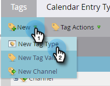

# 사용자 지정 태그 만들기 {#create-custom-tags}

태그는 프로그램을 구성하는 데 도움이 되지만 채널은 보고 목적으로 데이터를 수집하는 데 도움이 됩니다.

>[!NOTE]
>
>체크 아웃 [태그 이해](/help/marketo/product-docs/core-marketo-concepts/programs/working-with-programs/understanding-tags.md) 추가 정보.

>[!NOTE]
>
>**관리 권한 필요**

## 새 태그 유형 만들기 {#create-a-new-tag-type}

새 태그 유형을 만들려면:

1. 로 이동합니다. **관리** 섹션을 참조하십시오.

   

1. 클릭 **태그**.

   

1. 클릭 **새로 만들기** 을(를) 선택합니다. **새 태그 유형.**

   

1. 태그 유형의 이름을 입력합니다.

   

1. 태그 유형에 대해 원하는 값을 입력합니다. 클릭 **다른 추가** 추가 값을 입력하려면

   

1. 이 태그가 적용되는 프로그램 유형을 선택합니다.

   

1. 나열된 모든 프로그램 유형에 이 태그를 필수적으로 할지 여부를 결정합니다.

   

   >[!NOTE]
   >
   >* 새 프로그램을 만들 때마다 이 태그를 추가하려면 &quot;필수&quot;를 선택합니다.
   >* &#39;적용 대상&#39; 목록에서 프로그램 유형을 제거하면 해당 유형의 기존의 모든 프로그램에서 태그와 해당 값이 삭제됩니다. 기존 태그 값을 유지하고 이 태그를 다음에 대해 선택적으로 앞으로 이동하도록 하려면 _모두_ 프로그램 유형이 나열되면 &quot;필수&quot; 확인란을 선택하지 않은 상태로 둡니다.

   >[!TIP]
   >
   >일부 프로그램 유형에 필요한 유사한 태그를 만들고자 하지만 다른 프로그램 유형에 필요한 옵션을 제공하려면 각각 &quot;필수&quot;가 선택된 다른 프로그램 유형에 적용되고 &quot;필수&quot;가 선택되어 있지 않은 다른 프로그램 유형에 적용되는 두 개의 별도의 태그를 설정해야 합니다.

1. Click **Create**.

   
