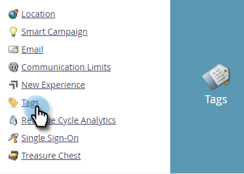
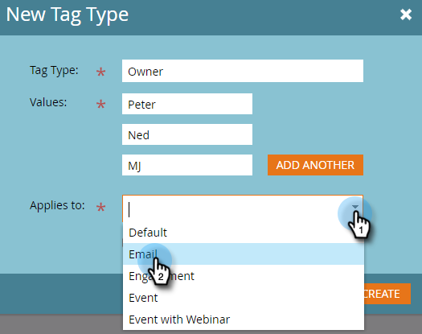

# 사용자 지정 태그 만들기 {#create-custom-tags}

태그는 프로그램을 구성하는 데 도움이 되며, 채널은 보고 목적으로 데이터를 수집하는 데 도움이 됩니다.

>[!NOTE]
>
>체크아웃 [태그 이해](/help/marketo/product-docs/core-marketo-concepts/programs/working-with-programs/understanding-tags.md) 추가 정보.

>[!NOTE]
>
>**관리자 권한 필요**

## 새 태그 유형 만들기 {#create-a-new-tag-type}

새 태그 유형을 만들려면 다음을 수행하십시오.

1. 로 이동 **[!UICONTROL 관리자]** 섹션.

   

1. 클릭 **[!UICONTROL 태그]**.

   

1. 클릭 **[!UICONTROL 신규]** 및 선택 **[!UICONTROL 새 태그 유형]**.

   

1. 태그 유형의 이름을 입력합니다.

   

1. 태그 유형에 대해 원하는 값을 입력합니다. 클릭 **[!UICONTROL 다른 항목 추가]** 추가 값을 입력합니다.

   

1. 이 태그가 적용되는 프로그램 유형을 선택합니다.

   

1. 나열된 모든 프로그램 유형에 이 태그가 필요한지 여부를 결정합니다.

   

   >[!NOTE]
   >
   >* 선택[!UICONTROL 필수]&quot;새 프로그램이 생성될 때마다 이 태그가 추가되도록 하려면&quot;을 선택합니다.
   >* 에서 프로그램 유형 제거[!UICONTROL 적용 대상]&#39; 목록은 해당 형식의 기존 모든 프로그램에서 태그와 해당 값을 삭제합니다. 기존 태그 값을 유지하고 다음 기간 동안 이 태그를 선택 사항으로 만들려면 _모두_ 프로그램 유형을 나열하고 &quot;필수&quot; 확인란을 선택하지 않은 상태로 둡니다.

   >[!TIP]
   >
   >일부 프로그램 유형에는 비슷한 태그가 필요하지만 다른 유형에는 선택 사항인 태그를 만들려면 각각 &quot;&quot;가 포함된 다른 프로그램 유형에 적용되는 두 개의 개별 태그를 설정해야 합니다.[!UICONTROL 필수]&quot;선택됨, 및 기타 에는 &quot;[!UICONTROL 필수]&quot;선택되지 않음.

1. Click **[!UICONTROL Create]**.

   
