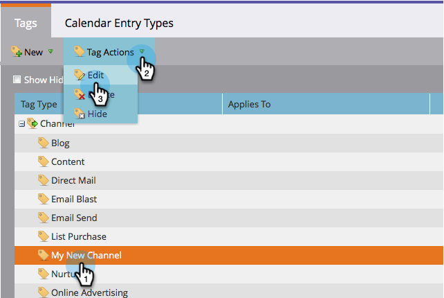

# 프로그램 채널 {#delete-a-program-status-from-a-program-channel}에서 프로그램 상태 삭제

프로그램 상태는 프로그램 경로(채널)를 통한 체크포인트입니다. 실수로 상태를 만들거나 더 이상 필요하지 않은 경우 자유롭게 삭제할 수 있습니다.

1. **관리** 섹션으로 이동합니다.

   

1. **태그**&#x200B;를 클릭합니다.

   

1. 상태를 제거할 채널을 선택한 다음 **태그 작업** 아래에서 **편집**&#x200B;을 클릭합니다.

   

1. 을 클릭하여 상태를 제거한 다음 **저장**&#x200B;을 클릭합니다.

   >[!TIP]
   >
   >현재 해당 상태에 지정된 사람이 있으면 삭제할 수 없지만 숨길 수 있습니다.

   

잘했다! 필요한 경우 [전체 채널](/help/marketo/product-docs/administration/tags/delete-a-program-channel.md)을 삭제할 수도 있습니다.
