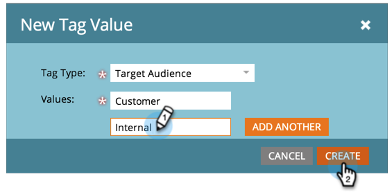

# 태그 값 관리 {#managing-tag-values}

[태그](/help/marketo/product-docs/core-marketo-concepts/programs/working-with-programs/understanding-tags.md)은(는) 프로그램을 설명하는 데 사용됩니다. 각각 고유한 값을 사용하여 필요한 만큼 만들 수 있습니다. 이러한 값을 관리하는 방법은 다음과 같습니다.

>[!NOTE]
>
>**관리자 권한 필요**

>[!PREREQUISITES]
>
>[새 프로그램 태그 및 태그 값 만들기](/help/marketo/product-docs/administration/tags/create-a-new-program-tag-and-tag-values.md)

## 태그 값 추가 {#adding-tag-values}

1. **[!UICONTROL Admin]** 영역으로 이동합니다.

   

1. **[!UICONTROL Tags]**&#x200B;를 클릭합니다.

   

1. **[!UICONTROL New]**&#x200B;을(를) 클릭한 다음 **[!UICONTROL New Tag Value]**&#x200B;을(를) 클릭합니다.

   

1. **[!UICONTROL Tag Type]**&#x200B;을(를) 선택합니다.

   

1. **[!UICONTROL Value]**&#x200B;을(를) 입력하고 **[!UICONTROL Add Another]**&#x200B;을(를) 클릭합니다. 원하는 만큼 값을 추가할 수 있습니다.

   

1. 나머지 값을 추가하고 **[!UICONTROL Create]**&#x200B;을(를) 클릭합니다.

   

변경 사항을 즉시 확인해야 합니다!

## 태그 값 숨기기 {#hiding-tag-values}

태그는 이전 프로그램에서 사용할 수 있습니다. 태그 유형을 숨겨서 나중에 사용할 수 있도록 더 이상 사용하지 않을 수 있습니다.

1. **[!UICONTROL Tag]**&#x200B;을(를) 선택하고 숨길 **[!UICONTROL Value]**&#x200B;을(를) 선택합니다.

   

1. **[!UICONTROL Tag Actions]**&#x200B;에서 **[!UICONTROL Hide]**&#x200B;을(를) 선택합니다.

   

## 숨겨진 값 표시 {#show-hidden-values}

숨겨진 값을 다시 보려면 다음을 수행하십시오.

1. **[!UICONTROL Show Hidden]** 확인란을 선택합니다. 선택하면 숨겨진 값을 볼 수 있습니다.

   

그런 다음 나중에 사용할 값의 숨김을 선택 취소할 수 있습니다.
