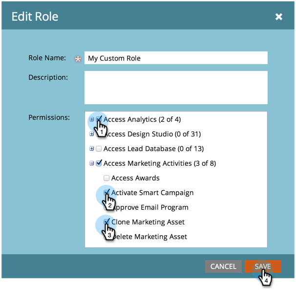
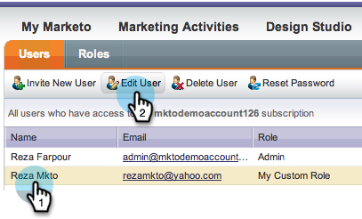

# 사용자 역할 만들기, 삭제, 편집 및 변경 {#create-delete-edit-and-change-a-user-role}

**여러** 권한 그룹을 취합합니다. **권한** 을 통해 Marketing Cloud에서 작업을 수행할 수 있습니다. **역할**&#x200B;을 사용자에게 할당합니다. 간편하게

>[!NOTE]
>
>**관리자 권한 필요**

## 역할 {#create-a-role} 만들기

1. **관리**&#x200B;로 이동하고 **사용자 및 역할**&#x200B;을 클릭합니다.

   

1. **역할 탭**&#x200B;으로 이동하고 **새 역할**&#x200B;을 클릭합니다.

   

1. 새 역할의 이름을 지정하고 역할과 연관된 사용자에게 부여할 모든 권한을 확인하고 **만들기**&#x200B;를 클릭합니다.

   

## 역할 {#delete-a-role} 삭제

1. **관리**&#x200B;에서 **사용자 및 역할**&#x200B;을 클릭합니다.

   

1. **역할** 탭에서 역할을 선택하고 **역할 삭제**&#x200B;를 클릭합니다.

   

1. **삭제**&#x200B;를 클릭하여 삭제를 확인합니다.

   

>[!NOTE]
>
>먼저 역할에 할당된 사용자가 없도록 해야 하며, 그렇지 않으면 삭제할 수 없습니다.

## 기존 역할 편집 {#edit-an-existing-role}

>[!NOTE]
>
>사용자 역할을 편집하려면 관리자 권한이 있는 다른 사용자로 로그인해야 합니다.

1. **관리**&#x200B;로 이동하고 **사용자 및 역할**&#x200B;을 클릭합니다.

   

1. **역할** 탭을 클릭합니다.

   

1. 편집할 역할을 선택하고 **역할 편집**&#x200B;을 클릭합니다.

   

1. 필요한 모든 내용을 변경하고 **저장**&#x200B;을 클릭합니다.

   

   >[!NOTE]
   >
   >역할에 대한 변경 사항은 이 역할에 연결된 모든 사용자에게 영향을 줍니다.

   >[!TIP]
   >
   >계정 이메일 주소를 업데이트하시겠습니까? [여기에서](/help/marketo/product-docs/administration/settings/edit-account-settings.md) 자세히 알아보십시오.

## 사용자 역할 변경 {#change-a-users-role}

1. **관리**&#x200B;로 이동하고 **사용자 및 역할**&#x200B;을 클릭합니다.

   

1. 다른 역할을 할당할 사용자를 선택하고 **사용자 편집을 클릭합니다.**

   

1. 이전 역할의 선택을 취소하고 새 역할을 선택한 다음 **저장**&#x200B;을 클릭합니다.

   

>[!NOTE]
>
>여러 역할을 선택한 상태로 두면 Marketing To는 기본적으로 가장 제한적인 권한을 가집니다.
