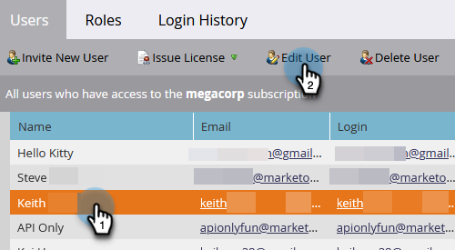

# 사용자 역할 만들기, 삭제, 편집 및 변경 {#create-delete-edit-and-change-a-user-role}

**역할**&#x200B;은(는) 여러 권한을 함께 그룹화합니다. **권한**&#x200B;을 통해 Marketo에서 작업을 수행할 수 있습니다. 사용자에게 **역할**&#x200B;을(를) 할당합니다. 식은 죽 먹기야.

>[!NOTE]
>
>**관리자 권한 필요**

>[!IMPORTANT]
>
>다음 역할은 시스템 역할이며 편집하거나 삭제할 수 없습니다.
>
>* 관리
>* Adobe 제품 관리자
>* 표준 사용자
>* RTP 편집기
>* RTP 런처

## 역할 만들기 {#create-a-role}

1. **[!UICONTROL Admin]** 영역으로 이동합니다.

   

1. **[!UICONTROL Users & Roles]**&#x200B;를 클릭합니다.

   

1. **[!UICONTROL Roles]** 탭으로 이동하여 **[!UICONTROL New Role]**&#x200B;을(를) 클릭합니다.

   

1. 새 역할 이름을 지정하고 역할과 관련된 사용자에게 부여할 모든 권한을 확인한 다음 **[!UICONTROL Create]**&#x200B;을(를) 클릭합니다.

   

## 역할 삭제 {#delete-a-role}

1. **[!UICONTROL Admin]** 영역으로 이동합니다.

   

1. **[!UICONTROL Users & Roles]**&#x200B;를 클릭합니다.

   

1. **[!UICONTROL Roles]** 탭에서 역할을 선택하고 **[!UICONTROL Delete Role]**&#x200B;을(를) 클릭합니다.

   

1. **[!UICONTROL Delete]**&#x200B;을(를) 클릭하여 삭제를 확인합니다.

   

>[!NOTE]
>
>먼저 역할에 할당된 사용자가 없는지 확인해야 합니다. 그렇지 않으면 삭제할 수 없습니다.

## 기존 역할 편집 {#edit-an-existing-role}

>[!NOTE]
>
>자신의 사용자 역할을 편집하려면 관리자 권한이 있는 다른 사용자로 로그인해야 합니다.

1. **[!UICONTROL Admin]** 영역으로 이동합니다.

   

1. **[!UICONTROL Users & Roles]**&#x200B;를 클릭합니다.

   

1. **[!UICONTROL Roles]** 탭을 클릭합니다.

   

1. 편집할 역할을 선택하고 **[!UICONTROL Edit Role]**&#x200B;을(를) 클릭합니다.

   

1. 필요한 모든 변경 내용을 적용한 다음 **[!UICONTROL Save]**&#x200B;을(를) 클릭합니다.

   

   >[!NOTE]
   >
   >역할에 대한 변경 사항은 이 역할에 연결된 모든 사용자에게 영향을 줍니다.

   >[!TIP]
   >
   >계정 이메일 주소를 업데이트하시겠습니까? [방법을 알아보세요](/help/marketo/product-docs/administration/settings/edit-account-settings.md).

## 사용자의 역할 변경 {#change-a-users-role}

1. **[!UICONTROL Admin]** 영역으로 이동합니다.

   

1. **[!UICONTROL Users & Roles]**&#x200B;를 클릭합니다.

   

1. 다른 역할을 할당할 사용자를 선택하고 **[!UICONTROL Edit User]**&#x200B;을(를) 클릭합니다.

   

1. 이전 역할을 선택 취소하고 새 역할을 선택한 다음 **[!UICONTROL Save]**&#x200B;을(를) 클릭합니다.

   

>[!NOTE]
>
>여러 역할을 선택한 상태로 두면 Marketo은 기본적으로 가장 제한적인 권한으로 설정됩니다.
