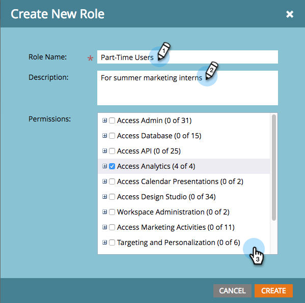

# 역할 권한 설명 {#descriptions-of-role-permissions}

다음은 역할에 할당할 수 있는 모든 사용 가능한 권한 목록입니다. 권한은 일반적으로 Marketo 내의 특정 기능 영역과 연결되며, 다양한 사용자가 액세스할 수 있는 영역 및 기능을 제어하는 데 도움이 됩니다.

권한에 대한 일부 추가 정보:

* 액세스 권한은 역할 권한을 부여하여 응용 프로그램의 해당 부분을 보고 편집할 수 있습니다.
* 역할이 하위 권한(&quot;만들기&quot;, &quot;삭제&quot; 등)에 액세스하려면 해당 역할에 애플리케이션의 해당 부분에 대한 &quot;액세스&quot; 권한이 있어야 합니다. 예를 들어 누군가에게 캠페인 편집에 대한 권한을 부여하려면 마케팅 활동에 액세스할 수 있는 전체 권한이 있어야 합니다.
* 사용 권한이 없는 작업이나 자산을 볼 수 있습니다. 그러나 액세스하려고 하면 제한된 액세스에 대해 경고하는 메시지가 표시됩니다.

## 사용 가능한 권한 {#available-permissions}

[역할을 만들거나 편집](/help/marketo/product-docs/administration/users-and-roles/managing-user-roles-and-permissions.md)할 때 해당 상자를 선택하여 다음 권한 중 해당 역할을 허용할 권한을 선택할 수 있습니다.

## 액세스 관리자  {#access-admin}

관리자의 [내 계정] 섹션에서 설정을 보고 변경합니다.

* Adobe Connect 액세스 - 사용자에게 Adobe Connect 화면에 대한 액세스 권한을 제공합니다.
* Adobe Experience Manager 액세스&#42; - 사용자에게 Adobe Experience Manager 화면에 대한 액세스 권한을 제공합니다.
* Adobe 조직 매핑에 액세스&#42; - 사용자에게 Adobe 조직 매핑 화면에 대한 액세스 권한을 제공합니다.
* 관리자 감사 추적 액세스&#42; - 사용자에게 관리자 감사 추적 화면에 대한 액세스 권한을 제공합니다.
* 액세스 액세스 감사 추적&#42; - 사용자에게 액세스 감사 추적에 대한 액세스 권한을 부여합니다.
* 감사 추적 액세스 - 사용자에게 자산 감사 추적 및 관리자 감사 추적에 대한 액세스 권한을 제공합니다.
* CAPTCHA 액세스 - CAPTCHA 화면에 액세스
* 액세스 채널 - 사용자에게 다른 사용자 지정 태그가 아닌 채널 태그를 수정할 수 있는 액세스 권한만 제공합니다.
* 액세스 통신 제한 - 관리에서 통신 제한을 활성화할 수 있는 액세스 권한을 사용자에게 부여합니다.
* CRM 액세스 - 사용자에게 관리자의 [!DNL Salesforce] 또는 [!DNL Microsoft Dynamics] 같은 CRM에 대한 액세스 권한을 제공합니다.
* 액세스 `Data.com` - 사용자에게 Data.com 흐름 작업에 대한 액세스 권한을 제공합니다.
* 이메일 관리자 액세스 - 사용자에게 이메일 관리자에 대한 액세스 권한을 부여하여 구독 취소 및 브랜딩 도메인과 같은 기본 설정을 변경할 수 있습니다.
* 액세스 이벤트 파트너 - 사용자에게 관리자의 LaunchPoint에 대한 액세스 권한을 제공합니다.
* Experience Cloud 대상 공유 액세스 - 사용자에게 Adobe Experience Cloud에서 Marketo Engage으로 대상을 동기화할 수 있는 액세스 권한을 제공합니다.
* 액세스 필드 관리 - 사용자에게 관리자의 필드 관리에 대한 액세스 권한을 제공합니다.
* Access 파일 업로드 - 사용자에게 이미지와 파일을 Design Studio에 업로드할 수 있습니다.
* 랜딩 페이지 액세스 - 사용자에게 관리자의 랜딩 페이지에 대한 액세스 권한을 제공합니다.
* 액세스 위치 - 사용자에게 기본 언어, 로케일, 시간대 및 통화를 설정하기 위해 관리자의 위치에 대한 액세스 권한을 제공합니다.
* 로그인 내역 액세스 - 감사 추적에서 사용자 로그인 내역에 대한 액세스 권한을 사용자에게 부여합니다.
* 로그인 설정 액세스 - 사용자에게 보안, IP 제한 및 스마트 목록 보고서 설정을 위한 관리자의 로그인 설정에 대한 액세스 권한을 제공합니다.
* 새 경험 액세스&#42; - 사용자에게 새 경험 화면에 대한 액세스 권한을 제공합니다.
* Marketo 사용자 지정 활동 액세스 - 사용자에게 관리자의 Marketo 사용자 지정 활동에 대한 액세스 권한을 제공합니다.
* Marketo 사용자 지정 개체 액세스 - 사용자에게 관리자의 Marketo 사용자 지정 개체에 대한 액세스 권한을 제공합니다.
* [!DNL Munchkin] 액세스 - GIves 사용자가 추적 코드, 개인 추적을 설정하고 API 구성을 사용하도록 설정하기 위해 관리자의 [!DNL Munchkin]에 액세스할 수 있음
* Predictive Audiences 액세스&#42; - 사용자에게 Predictive Audiences 화면에 대한 액세스 권한을 제공합니다.
* 수익 주기 분석 액세스 - 동기화 요약 및 속성을 설정할 수 있도록 관리에서 수익 주기 분석에 대한 액세스 권한을 사용자에게 제공합니다.
* 액세스 역할 - 사용자에게 역할 관리 및 편집에 대한 액세스 권한을 부여하지만 사용자는 부여하지 않습니다.
* Sales Insight 액세스 - 상태, API 구성, 개인 점수 및 기타 설정을 설정하기 위해 관리자에서 Sales Insight을 관리할 수 있는 액세스 권한을 사용자에게 제공합니다
* SSO(Single Sign-On) 액세스 - SAML을 활성화하고 SAML 설정 및 리디렉션 페이지 URL을 사용하여 작업할 수 있도록 관리자에서 SSO(Single Sign-On)를 관리할 수 있는 액세스 권한을 사용자에게 제공합니다.
* 스마트 캠페인 액세스 - 적격 인원에 대한 제한을 제한할 수 있도록 관리자의 스마트 캠페인에 대한 액세스 권한을 사용자에게 제공합니다.
* SOAP API 액세스 - 사용자에게 Admin의 웹 서비스에서 SOAP API를 관리할 수 있는 액세스 권한을 제공합니다.
* 액세스 태그 - 사용자에게 채널 태그를 제외한 모든 사용자 지정 태그에 대한 액세스 권한을 제공합니다.
* Access Treasure Chest - 사용자에게 관리자의 Treasure Chest에 있는 실험 기능에 대한 액세스를 제공합니다.
* 사용자 액세스 - 사용자에게 Admin에서 사용자(역할은 아님)를 편집하고 관리할 수 있는 액세스 권한을 제공합니다.
* 웹후크 액세스 - 세부 정보 및 응답 매핑을 설정할 수 있도록, 관리자의 웹후크에 사용자를 제공합니다.
* 작업 공간 및 분할 영역 액세스 - 사용자에게 관리에서 작업 공간 및 분할 영역을 생성, 편집 및 삭제할 수 있는 액세스 권한을 제공합니다.

_&#42;기존 사용자가 중단되는 것을 방지하기 위해 이 권한은 수동 모드로 도입되고 있으며 현재 표시되지만 액세스할 수 없습니다. 2024년 중반에 활성화될 때 구현하는 방법을 알려 드리겠습니다._

## 액세스 API  {#access-api}

**API만** **역할** 액세스 권한을 가진 사용자에게 아래 나열된 개별 API에 대한 액세스 권한을 제공합니다.

* Assets 승인
* 캠페인 실행
* 읽기 전용 활동
* 읽기 전용 활동 메타데이터
* 읽기 전용 Assets
* 읽기 전용 캠페인
* 읽기 전용 회사
* 읽기 전용 사용자 지정 개체
* 읽기 전용 사용자
* 읽기 전용 명명된 계정
* 읽기 전용 영업 기회
* 읽기 전용 영업 담당자
* 읽기-쓰기 활동
* 읽기-쓰기 활동 메타데이터
* Assets 읽기-쓰기
* 캠페인 읽기-쓰기
* 읽기-쓰기 회사
* 사용자 지정 개체 읽기-쓰기
* 읽기-쓰기 사용자
* 명명된 계정 읽기-쓰기
* 읽기-쓰기 영업 기회
* 읽기-쓰기 영업 담당자

## Analytics 액세스 {#access-analytics}

선택하지 않은 경우 사용자에게 Analytics 탭, 이메일 인사이트, 보고서 및 아래 세 가지 항목에 대한 액세스 권한을 제공합니다.

* 매출 탐색기 액세스 - 선택을 취소하면 매출 탐색기에 대한 사용자의 액세스 권한이 제거됩니다.
* 보고서 만들기&#42; - 사용자에게 Analytics 및 마케팅 활동과 수익 주기 Modeler 에셋에서 보고서 에셋을 생성, 복제, 읽기, 업데이트 및 이동할 수 있는 액세스 권한을 제공합니다.
* 보고서 삭제 - 선택을 취소하면 보고서를 삭제할 수 있는 사용자의 기능이 제거됩니다.
* Analytics 데이터 내보내기 - 선택을 취소하면 Analytics 데이터를 내보내는 사용자의 기능이 제거됩니다

_&#42;기존 사용자가 중단되는 것을 방지하기 위해 이 권한은 수동 모드로 도입되고 있으며 현재 표시되지만 액세스할 수 없습니다. 2024년 중반에 활성화될 때 구현하는 방법을 알려 드리겠습니다._

## 캘린더 프레젠테이션에 액세스 {#access-calendar-presentations}

사용자에게 달력 프레젠테이션에 대한 액세스 권한을 부여합니다. - 하단에 프레젠테이션 단추를 표시할 수 있습니다.

* 달력 프레젠테이션 편집 - 달력에서 사용자가 프레젠테이션을 편집할 수 있도록 설정

## Design Studio 액세스 {#access-design-studio}

사용자에게 Design Studio 탭 및 트리 보기에 대한 액세스 권한을 제공하지만 세부 정보에는 액세스할 수 없습니다.

* 전자 메일 액세스
   * 이메일 편집 - 사용자에게 이메일을 편집, 생성 및 복제할 수 있는 권한을 제공합니다.
      * 작업 이메일 만들기 및 편집 - 사용자에게 작업 이메일을 만들거나 편집할 수 있는 권한을 제공합니다. 참조: [전자 메일 작동 설정](/help/marketo/product-docs/email-marketing/general/functions-in-the-editor/make-an-email-operational.md)

      * 이메일 승인 - 사용자가 이메일을 승인할 수 있습니다.
      * 이메일 삭제 - 사용자가 이메일을 삭제할 수 있습니다.
      * 브랜드 도메인 설정 - 사용자가 브랜딩 도메인으로 작업할 수 있습니다. 참조: [추가 브랜딩 도메인 추가](/help/marketo/product-docs/administration/email-setup/add-multiple-branding-domains/add-an-additional-branding-domain.md)

* 이메일 템플릿 액세스

   * 이메일 템플릿 승인
   * 이메일 템플릿 삭제
   * 이메일 템플릿 편집 - 이메일 템플릿 편집, 생성 및 복제

* 액세스 양식

   * 승인 양식
   * 양식 삭제
   * 양식 편집 - 양식 편집, 생성 및 복제

* 이미지 액세스

   * 이미지 삭제
   * 이미지 업로드

* 랜딩 페이지 액세스

   * 랜딩 페이지 승인
   * 랜딩 페이지 삭제
   * 랜딩 페이지 편집 - 랜딩 페이지 편집, 생성 및 복제

* 랜딩 페이지 템플릿 액세스

   * 랜딩 페이지 템플릿 승인
   * 랜딩 페이지 템플릿 삭제
   * 랜딩 페이지 템플릿 편집 - 랜딩 페이지 템플릿을 편집, 생성 및 복제

* 코드 조각 액세스

   * 코드 조각 승인
   * 코드 조각 삭제
   * 코드 조각 편집

* 소셜 앱 액세스

   * 소셜 앱 승인
   * 소셜 앱 삭제
   * 소셜 앱 편집

## 데이터베이스 액세스 {#access-database}

데이터베이스를 보고 스마트/정적 목록을 보고 편집합니다.

* 액세스 세그멘테이션

   * 세분화 승인
   * 세분화 삭제
   * 세분화 편집

* 사용자 삭제
* &#42; 목록 만들기
   * 데이터베이스 및 마케팅 활동에서 목록 자산을 만들기 위한 액세스 권한
   * 데이터베이스 및 마케팅 활동에서 스마트 목록 자산을 만들기 위한 액세스 권한
* 목록 삭제
* 개인 편집 - 수동 편집과 단일 흐름 단계 실행을 방지합니다. 개인에 대해 캠페인을 실행하여 사용자를 편집할 수도 있습니다.
* 사용자 내보내기 - 데이터베이스 목록에서 스프레드시트를 내보냅니다.
* 사용자 지정 개체 가져오기
* 목록 가져오기
* 사람 병합
* 단일 흐름 작업 실행 - 사용자가 데이터베이스의 사용자에 대해 **데이터 값 변경** 흐름 단계를 실행할 수 있습니다.

* 영업 기회 데이터 보기 - 개인 세부 정보 페이지의 영업 기회 정보를 숨깁니다.

_&#42;기존 사용자가 중단되는 것을 방지하기 위해 이 권한은 수동 모드로 도입되고 있으며 현재 표시되지만 액세스할 수 없습니다. 2024년 중반에 활성화될 때 구현하는 방법을 알려 드리겠습니다._

## 마케팅 활동 액세스 {#access-marketing-activities}

마케팅 활동 탭, 캠페인 및 캠페인 폴더를 봅니다.

* SMS 메시지 액세스

   * SMS 메시지 승인
   * SMS 메시지 삭제
   * SMS 메시지 편집

* 푸시 알림 액세스

   * 푸시 알림 승인
   * 푸시 알림 삭제
   * 푸시 알림 편집

* 액세스 어워드
* 트리거 캠페인 활성화
* 이메일 프로그램 승인
* 마케팅 자산 복제
* 마케팅 자산 삭제
* 캠페인 제한 편집
* 마케팅 자산 편집
* 캠페인 활동 내보내기&#42;
* 프로그램 가져오기
* 목록 가져오기
* 배치 캠페인 예약

SEO 액세스

* SEO 관리
* 표준 SEO

_&#42;기존 사용자가 중단되는 것을 방지하기 위해 이 권한은 수동 모드로 도입되고 있으며 현재 표시되지만 액세스할 수 없습니다. 2024년 중반에 활성화될 때 구현하는 방법을 알려 드리겠습니다._

## 타깃팅 및 Personalization {#targeting-and-personalization}

* 웹 Personalization 관리
* 캠페인 편집기
* CRE 캠페인 런처
* 웹 캠페인 편집기
* 웹 캠페인 런처

Workspace 관리

* 특정 Workspace에 대한 관리자 액세스 권한 (작업 공간이 활성화된 경우에만)
* 작업 영역 간에 자산 이동(작업 영역이 활성화된 경우에만)
