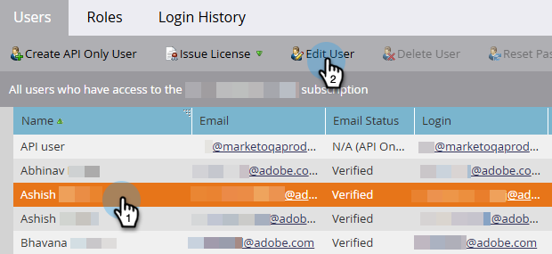

# 사용자 작업 영역 편집 {#edit-user-workspaces}

1. **[!UICONTROL Admin]** 영역으로 이동합니다.

   

1. **[!UICONTROL Users & Roles]**&#x200B;를 클릭합니다.

   

1. 원하는 사용자를 선택하고 **[!UICONTROL Edit User]**&#x200B;을(를) 클릭합니다.

   

1. 원하는 대로 변경하고 **[!UICONTROL Save]**&#x200B;을(를) 클릭합니다.

   
