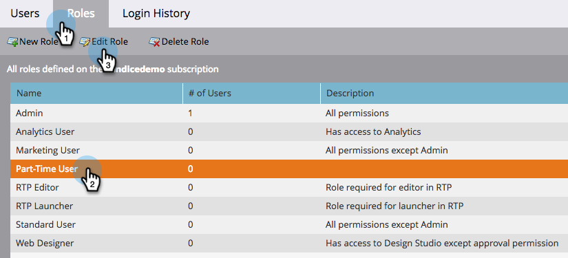

# 스니펫에 대한 초안 없음 기능 활성화 {#enable-no-draft-for-snippets}

코드 조각에 대한 초안 없음 을 사용하면 승인된 에셋을 작성하지 않고 코드 조각 변경 사항을 배포할 수 있습니다. 편집된 스니펫을 사용하는 모든 자산은 업데이트를 받고 각각의 상태를 유지합니다.

* 승인된 자산은 코드 조각 업데이트를 받고 승인된 상태를 유지합니다.

* 초안은 코드 조각 업데이트를 가져오고 초안 모드 유지

모든 관리자 역할에 대해 No-Draft가 자동으로 활성화됩니다. 그런 다음 관리자는 추가 역할에 대해 이 기능을 활성화할 수 있습니다.

>[!NOTE]
>
>**관리자 권한 필요**

1. **[!UICONTROL Admin]** 영역으로 이동합니다.

   

1. **[!UICONTROL Users & Roles]**&#x200B;를 클릭합니다.

   

1. **[!UICONTROL Roles]** 탭으로 이동하여 역할을 선택한 다음 **[!UICONTROL Edit Role]**&#x200B;을(를) 클릭합니다.

   

1. **[!UICONTROL Access Design Studio]** 옵션을 확장합니다.

   

1. **[!UICONTROL Access Snippet]** 옵션을 확장합니다.

   

1. **[!UICONTROL Approve Snippet]** 권한을 확장하고 **[!UICONTROL No-Draft]** 상자를 선택합니다. 그런 다음 **[!UICONTROL Save]**&#x200B;를 클릭합니다.

   

>[!TIP]
>
>[초안 없음]을 사용하지 않으려면 위의 1-4단계에 따라 [초안 없음] 확인란의 선택을 취소하고 **[!UICONTROL Save]**&#x200B;을(를) 클릭하십시오.

>[!MORELIKETHIS]
>
>[초안이 없는 코드 조각 승인](/help/marketo/product-docs/personalization/segmentation-and-snippets/snippets/approve-a-snippet-with-no-draft.md){target="_blank"}
