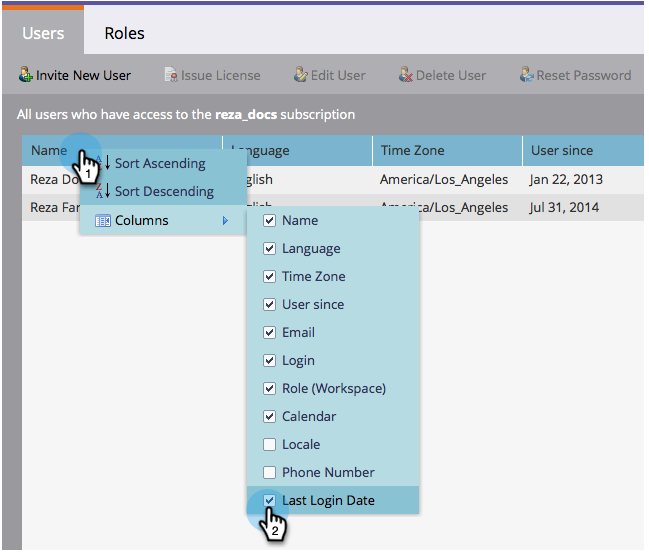

# 사용자 및 역할 목록 내보내기 {#export-a-list-of-users-and-roles}

>[!NOTE]
>
>**관리자 권한 필요**

사용자와 사용자 역할의 전체 목록을 손쉽게 내보낼 수 있습니다. 방법

1. 관리자로 **이동합니다**.

   

1. 사용자 **및 역할을 클릭합니다**.

   

1. 내보내기 전에 원하는 열을 추가/제거합니다.

   >[!TIP]
   >
   >역할을 내보내려면 먼저 **역할******탭으로 이동한 다음 내보내십시오.

   

1. **내보내기 **아이콘을 클릭합니다.

   

   여러분 모두 그렇습니다! 새 Excel 파일을 다운로드해야 합니다.

   

