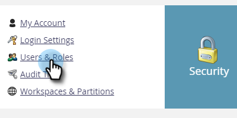
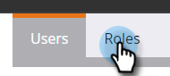

# 역할 및 권한 내보내기 {#export-roles-and-permissions}

모든 역할과 해당 권한을 내보내는 방법은 다음과 같습니다.

>[!NOTE]
>
>관리자 권한 필요

1. **[!UICONTROL Admin]** 영역으로 이동합니다.

   

1. **[!UICONTROL Users & Roles]**&#x200B;를 선택합니다.

   

1. **[!UICONTROL Roles]** 탭을 클릭합니다.

   

1. 페이지 하단으로 스크롤한 다음 내보내기 단추를 클릭합니다.

   

>[!NOTE]
>
>브라우저가 Marketo의 팝업을 차단하지 않는지 확인하십시오.

데이터는 CSV로 내보내지고 역할, 권한 및 그룹당 활성화된 권한 수가 포함됩니다.

