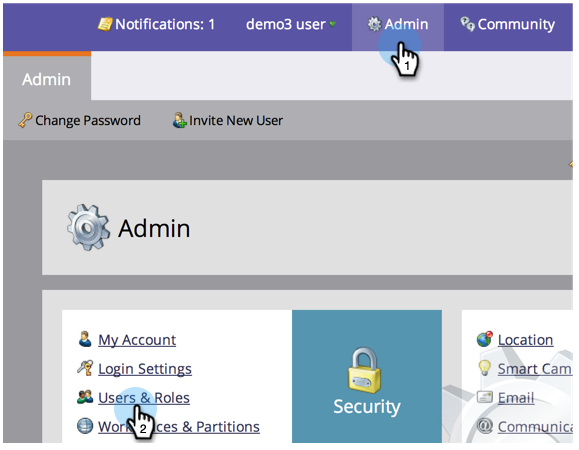

# 마케팅 사용자 관리 {#managing-marketo-users}

## 사용자 만들기 {#create-users}

1. **관리**&#x200B;로 이동하고 **사용자 및 역할**&#x200B;을 클릭합니다.

   

1. **새 사용자 초대**&#x200B;를 클릭합니다.

   

1. **이메일 주소**, **이름** 및 **성을 입력합니다.**

   ** 

   **

1. 원할 경우, 초대 이유를 입력하고 날짜 선택기를 사용하여 **액세스 만료** 필드에서 만료 날짜를 선택합니다.

   

1. **다음**&#x200B;을 클릭합니다.

   

   >[!TIP]
   >
   >만료 날짜는 Marketing이 짧은 시간 동안만 액세스해야 하는 단기 외부 관계자 또는 컨설턴트에게 적합합니다.

   >[!NOTE]
   >
   >만료일이 도래하면 만료 알림을 받게 되고 계정이 잠깁니다.

1. **Role **을 선택하고 **다음**&#x200B;을 클릭합니다.

   

1. 필요한 경우 초대 메시지를 편집합니다. **보내기**&#x200B;를 클릭합니다.

   

   >[!NOTE]
   >
   >이메일/로그인은 고유해야 합니다.샌드박스 인스턴스에서 이미 사용한 경우 프로덕션에서 다른 인스턴스를 사용해야 하며 그 반대의 경우도 마찬가지입니다.

   

   >[!NOTE]
   >
   >초대는 새 사용자가 추가된 후 3일 후에 만료됩니다.

이제 새 사용자가 [사용자] 탭에 나열되며 계정 활성화 방법에 대한 지침이 포함된 이메일을 수신하게 됩니다.

## 사용자 삭제 {#delete-users}

1. 관리자로 이동하고 사용자 및 역할을 클릭합니다.

   

1. 제거할 사용자를 선택하고 [사용자 삭제]를 클릭합니다.

   

1. 확인을 클릭하여 확인합니다.

   

## 사용자 암호 재설정 {#reset-user-passwords}

1. 관리자로 이동하고 사용자 및 역할을 클릭합니다.

   

1. 사용자를 선택하고 암호 재설정을 클릭합니다.

   

1. 닫기를 클릭하여 메시지를 닫습니다.

   

사용자는 암호 재설정 지침이 포함된 이메일을 수신하게 됩니다.

>[!TIP]
>
>받은 편지함에 해당 이메일이 표시되지 않는 경우 스팸/스팸 폴더를 확인하도록 요청하십시오.

## 권한 변경 및 사용자 정보 편집 {#change-permissions-and-edit-user-information}

1. **관리**&#x200B;로 이동하고 **사용자 및 역할을 클릭합니다.**

   

1. 사용자를 선택하고 **사용자 편집**&#x200B;을 클릭합니다.

   

1. 사용자 정보를 편집하고 관련 역할을 변경할 수 있습니다. **저장**&#x200B;을 클릭합니다.

   

>[!CAUTION]
>
>Marketing의 유일한 관리자인 경우 자신의 관리자 권한을 제거하지 마십시오.

>[!NOTE]
>
>새 사용자가 관리자로 초대되거나 관리자가 삭제되는 경우 현재 모든 관리자는 이메일 알림을 받게 됩니다.

멋진 작품! 이제 사용자를 만들고, 사용자를 삭제하고, 사용자 암호를 재설정하고, 사용자를 편집하는 방법을 알 수 있습니다.
