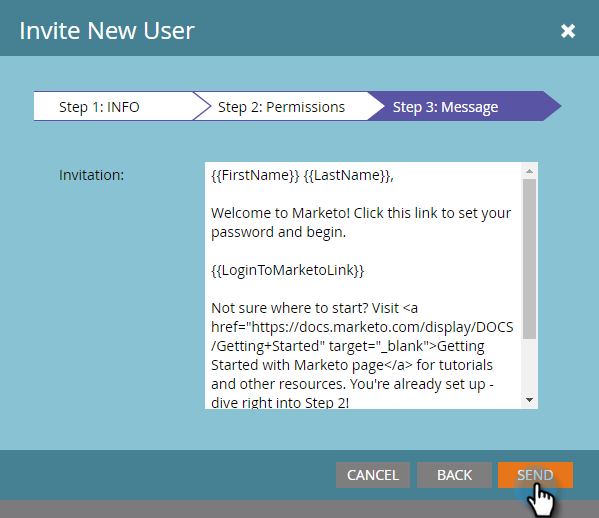

# Marketo 사용자 관리 {#managing-marketo-users}

## 사용자 만들기 {#create-users}

1. 로 이동합니다. **관리** 영역.

   

1. 클릭 **사용자 및 역할**.

   

1. 클릭 **새 사용자 초대**.

   

1. 을(를) 입력합니다. **이메일 주소**, **이름**, 및 **성**.

   

1. 초대의 이유를 입력하고(선택적) **액세스 만료** 날짜 선택기를 사용하는 필드.

   

1. 클릭 **다음**.

   

   >[!TIP]
   >
   >만료 날짜는 짧은 시간 동안만 Marketo 액세스 권한이 필요한 단기 외부 이해 당사자나 컨설턴트에게 적합합니다.

   >[!NOTE]
   >
   >만료 날짜가 되면 사용자는 만료 알림을 받고 해당 계정이 잠깁니다.

1. 을(를) 선택합니다 **역할** 선택한 후 **다음**.

   

1. 필요한 경우 초대 메시지를 편집합니다. 클릭 **보내기**.

   

   >[!NOTE]
   >
   >이메일/로그인은 고유해야 합니다. 샌드박스 인스턴스에서 이미 사용한 경우 프로덕션에서 다른 인스턴스를 사용하고 그 반대의 경우 이를 사용해야 합니다.

   

   >[!NOTE]
   >
   >초대장은 새 사용자가 추가된 후 3일 후에 만료됩니다.

이제 새 사용자가 사용자 탭에 나열되며 계정을 활성화하는 방법에 대한 지침이 포함된 이메일을 받게 됩니다.

## 사용자 삭제 {#delete-users}

1. 로 이동합니다. **관리** 영역.

   

1. 클릭 **사용자 및 역할**.

   

1. 제거할 사용자를 선택하고 을(를) 클릭합니다 **사용자 삭제**.

   

1. 을 클릭하여 확인 **확인**.

   

## 사용자 암호 재설정 {#reset-user-passwords}

1. 관리 영역으로 이동합니다.

   

1. 클릭 **사용자 및 역할**.

   

1. 사용자를 선택하고 을(를) 클릭합니다. **암호 재설정**.

   

1. 클릭 **닫기** 메시지를 닫습니다.

   

사용자는 암호 재설정 지침이 포함된 이메일을 받게 됩니다.

>[!TIP]
>
>사용자가 받은 편지함에 이메일이 표시되지 않으면 스팸/스팸 폴더를 확인하도록 요청하십시오.

## 권한 변경 및 사용자 정보 편집 {#change-permissions-and-edit-user-information}

1. 로 이동합니다. **관리** 영역.

   

1. 클릭 **사용자 및 역할**.

   

1. 사용자를 선택하고 을(를) 클릭합니다. **사용자 편집**.

   

1. 사용자 정보를 편집하고 관련 역할을 변경할 수 있습니다. 클릭 **저장**.

   

>[!CAUTION]
>
>Marketo의 유일한 관리자인 경우 고유한 관리 권한을 제거하지 마십시오.

>[!NOTE]
>
>새 사용자를 관리자로 초대받거나 관리자가 삭제되는 경우 현재 모든 관리자가 이메일 알림을 받게 됩니다.

멋진 일! 이제 사용자를 만들고, 사용자를 삭제하고, 사용자의 암호를 재설정하고, 사용자를 편집하는 방법을 알 수 있습니다.
