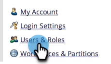

# Marketo 사용자 관리 {#managing-marketo-users}

>[!IMPORTANT]
>
>이 문서는 다음을 수행하는 사람만을 위한 것입니다. _아님_ 사용 [Adobe ID가 있는 Marketo](/help/marketo/product-docs/administration/marketo-with-adobe-identity/adobe-identity-management-overview.md){target="_blank"}. If you do, please follow the steps in [this article](/help/marketo/product-docs/administration/marketo-with-adobe-identity/add-or-remove-a-user.md){target="_blank"} 대신,

## 사용자 만들기 {#create-users}

1. 로 이동 **[!UICONTROL 관리자]** 영역입니다.

   

1. 클릭 **[!UICONTROL 사용자 및 역할]**.

   

1. 클릭 **[!UICONTROL 새 사용자 초대]**.

   

1. 다음을 입력합니다. **[!UICONTROL 이메일]**, **[!UICONTROL 이름]**, 및 **[!UICONTROL 성]**.

   

1. 초대에 대한 사유를 입력하고 다음 창에서 만료 일자를 선택합니다(선택적). **[!UICONTROL 액세스 만료]** 날짜 선택기를 사용하는 필드입니다.

   

1. 클릭 **[!UICONTROL 다음]**.

   

   >[!TIP]
   >
   >만료 날짜는 짧은 시간 동안만 Marketo 액세스가 필요한 단기 외부 관련자 또는 컨설턴트에게 적합합니다.

   >[!NOTE]
   >
   >만료 날짜가 되면 사용자는 만료 알림을 받고 계정이 잠깁니다.

1. 다음 항목 선택 **[!UICONTROL 역할]** 을(를) 선택하고 **[!UICONTROL 다음]**.

   

1. 필요한 경우 초대 메시지를 편집합니다. 클릭 **Se번째**.

   

   >[!NOTE]
   >
   >이메일/로그인은 고유해야 합니다. 샌드박스 인스턴스에서 이미 사용한 경우에는 프로덕션에서 다른 이메일/로그인을 사용해야 하며 그 반대의 경우도 마찬가지입니다.

   

   >[!NOTE]
   >
   >초대는 새 사용자를 추가한 후 3일 후에 만료됩니다.

이제 새 사용자가 사용자 탭에 나열되며 계정 활성화 방법에 대한 지침이 포함된 이메일을 받게 됩니다.

## 사용자 삭제 {#delete-users}

>[!NOTE]
>
>삭제할 사용자가 Dynamic Chat 사용자이기도 한 경우 다음을 수행해야 합니다 [Dynamic Chat에서 제거](/help/marketo/product-docs/demand-generation/dynamic-chat/setup-and-configuration/add-or-remove-chat-users.md#remove-a-chat-user){target="_blank"} Marketo Engage에서 삭제하기 전에 Admin Console에서.

1. 로 이동 **[!UICONTROL 관리자]** 영역입니다.

   

1. 클릭 **[!UICONTROL 사용자 및 역할]**.

   

1. 제거할 사용자를 선택하고 **[!UICONTROL 사용자 삭제]**.

   

1. 을(를) 클릭하여 확인 **[!UICONTROL 확인]**.

   

## 사용자 암호 재설정 {#reset-user-passwords}

1. 로 이동 **[!UICONTROL 관리자]** 영역입니다.

   

1. 클릭 **[!UICONTROL 사용자 및 역할]**.

   

1. 사용자를 선택하고 **[!UICONTROL 암호 재설정]**.

   

1. 클릭 **[!UICONTROL 닫기]** 을 눌러 프롬프트를 닫습니다.

   

사용자는 암호 재설정 지침이 포함된 이메일을 받게 됩니다.

>[!TIP]
>
>받은 편지함에 전자 메일이 표시되지 않으면 정크/스팸 폴더를 확인하도록 요청하세요.

## 권한 변경 및 사용자 정보 편집 {#change-permissions-and-edit-user-information}

1. 로 이동 **[!UICONTROL 관리자]** 영역입니다.

   

1. 클릭 **[!UICONTROL 사용자 및 역할]**.

   

1. 사용자를 선택하고 **[!UICONTROL 사용자 편집]**.

   

1. 사용자 정보를 편집하고 관련 역할을 변경할 수 있습니다. **[!UICONTROL 저장]**&#x200B;을 클릭합니다.

   

>[!CAUTION]
>
>Marketo의 유일한 관리자인 경우 자신의 관리 권한을 제거하지 마십시오.

>[!NOTE]
>
>새 사용자를 관리자로 초대하거나 관리자가 삭제되면 현재 모든 관리자가 이메일 알림을 받습니다.

멋진 작품이야! 이제 사용자를 만들고, 사용자를 삭제하고, 사용자의 암호를 재설정하고, 사용자를 편집하는 방법을 알 수 있습니다.
