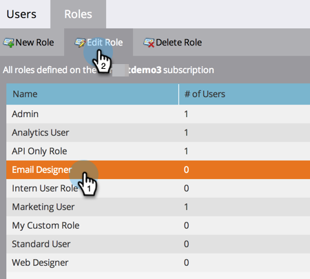

# 사용자 역할 및 권한 관리 {#managing-user-roles-and-permissions}

사용자 역할을 설정, 생성 및 편집하고 사용자에게 할당합니다. 이를 통해 각 Marketo 사용자가 액세스할 수 있는 영역 및 기능을 제어할 수 있습니다.

예를 들어 마케팅 사용자는 일반적으로 이메일, 랜딩 페이지 및 프로그램을 만들고, 수정하고, 배포하기 위해 애플리케이션 전반에서 광범위한 액세스 권한이 필요합니다. 반면에 웹 디자이너는 거의 모든 시간을 Design Studio에서 이메일과 랜딩 페이지에 사용할 자산을 만드는 데 사용합니다. 또한 회사 리더는 Analytics 영역에서 Marketo 보고서를 광범위하게 사용하지만 에셋 또는 프로그램 자체를 만들거나 구동할 필요가 없을 수 있습니다.

>[!NOTE]
>
>**관리자 권한 필요**

Marketo은 다양한 액세스 수준을 갖는 몇 가지 기본 제공 역할을 제공합니다.

* **관리자** - 응용 프로그램의 모든 부분(관리자 섹션 포함)
* **표준 사용자** - 응용 프로그램의 모든 부분(관리 섹션 제외)
* **마케팅 사용자** - 관리 섹션을 제외한 응용 프로그램의 모든 부분
* **웹 Designer** - Design Studio만 해당
* **Analytics 사용자** - Analytics 섹션만

관리자 및 표준 사용자 역할은 편집할 수 없지만 다른 역할은 편집할 수 있습니다. 회사의 특정 조직 구조와 일치하도록 새 사용자 정의 역할을 만들 수도 있습니다.

## Adobe ID가 있는 Marketo {#marketo-with-adobe-identity}

Adobe ID가 있는 Marketo을 사용하는 경우 프로필 설명 목록 [은(는) 여기에서 찾을 수 있습니다](/help/marketo/product-docs/administration/marketo-with-adobe-identity/adobe-identity-management-overview.md#profile-levels).

## 사용자에게 역할 할당 {#assign-roles-to-a-user}

[처음 사용자를 만들 때](/help/marketo/product-docs/administration/users-and-roles/create-delete-edit-and-change-a-user-role.md) 또는 [기존 사용자를 편집](/help/marketo/product-docs/administration/users-and-roles/managing-marketo-users.md)하여 사용자에게 역할을 할당할 수 있습니다.

1. **[!UICONTROL 관리자]** 영역으로 이동합니다.

   

1. **[!UICONTROL 사용자 및 역할]**&#x200B;을 클릭합니다.

   

1. 목록에서 편집할 사용자를 선택하고 **[!UICONTROL 사용자 편집]**&#x200B;을 클릭합니다.

   

1. **[!UICONTROL 역할]**&#x200B;에서 사용자에게 할당할 역할을 필요한 권한에 따라 선택하고 **[!UICONTROL 저장]**&#x200B;을 클릭합니다.

   

   >[!NOTE]
   >
   >각 역할에 대해 알아보려면 [역할 권한에 대한 설명](/help/marketo/product-docs/administration/users-and-roles/descriptions-of-role-permissions.md)을 참조하세요.

## 새 역할 만들기 {#create-a-new-role}

경우에 따라 조직에 사용자 정의 권한 조합이 필요한 매우 구체적인 역할의 직원이 있습니다.

1. **[!UICONTROL 관리자]** 영역으로 이동합니다.

   

1. **[!UICONTROL 사용자 및 역할]**&#x200B;을 클릭합니다.

   

1. **[!UICONTROL 역할]** 탭을 클릭합니다.

   

1. **[!UICONTROL 새 역할]**&#x200B;을 클릭합니다.

   

1. **[!UICONTROL 역할 이름]**, **[!UICONTROL 설명]**(선택 사항)을 입력하고 이 역할의 사용자에게 필요한 권한을 선택하십시오.

   

## 역할 편집 {#edit-a-role}

기존 역할과 연결된 권한을 변경해야 하는 경우 역할을 편집할 수 있습니다.

1. **[!UICONTROL 관리자]** 영역으로 이동합니다.

   

1. **[!UICONTROL 사용자 및 역할]**&#x200B;을 클릭합니다.

   

1. **[!UICONTROL 역할]** 탭을 클릭합니다.

   

1. 목록에서 수정할 역할을 선택하고 **[!UICONTROL 역할 편집]**&#x200B;을 클릭합니다.

   

1. 필요한 경우 **[!UICONTROL 역할 이름]** 및 **[!UICONTROL 설명]**&#x200B;을 변경한 다음 관련 **[!UICONTROL 권한]**&#x200B;의 선택을 변경하십시오.

   

   >[!NOTE]
   >
   >편집한 역할이 있는 사용자는 로그아웃했다가 다시 로그인하면 수정된 권한을 받게 됩니다.

## 역할 삭제 {#delete-a-role}

역할이 불필요하게 되면 삭제할 수 있습니다.

1. **[!UICONTROL 관리자]** 영역으로 이동합니다.

   

1. **[!UICONTROL 사용자 및 역할]**&#x200B;을 클릭합니다.

   

1. **[!UICONTROL 역할]** 탭을 클릭합니다.

   

1. 목록에서 삭제할 역할을 선택하고 **[!UICONTROL 역할 삭제]**&#x200B;를 클릭합니다.

   

1. 확인하려면 **[!UICONTROL 삭제]**&#x200B;를 클릭하세요.

   
